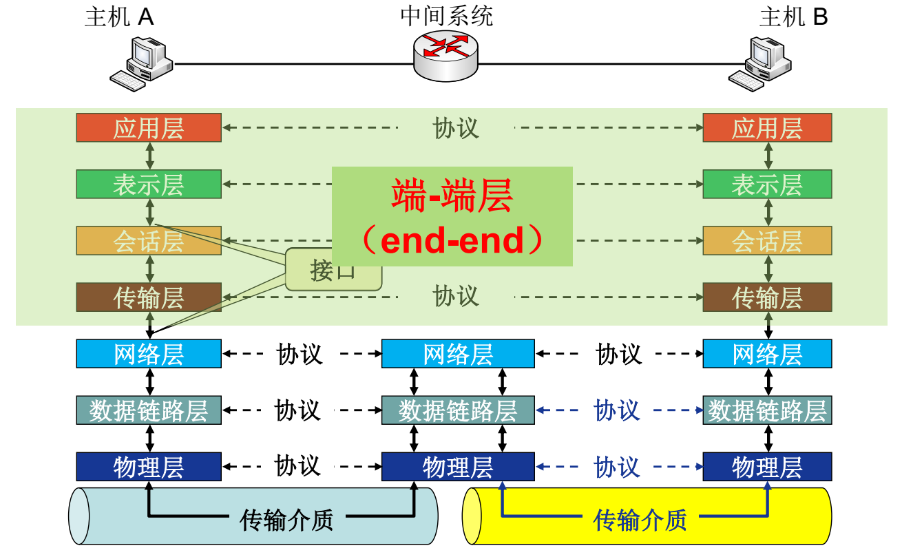
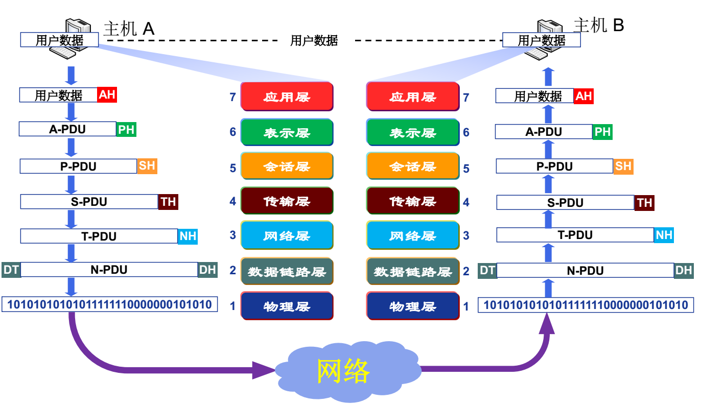
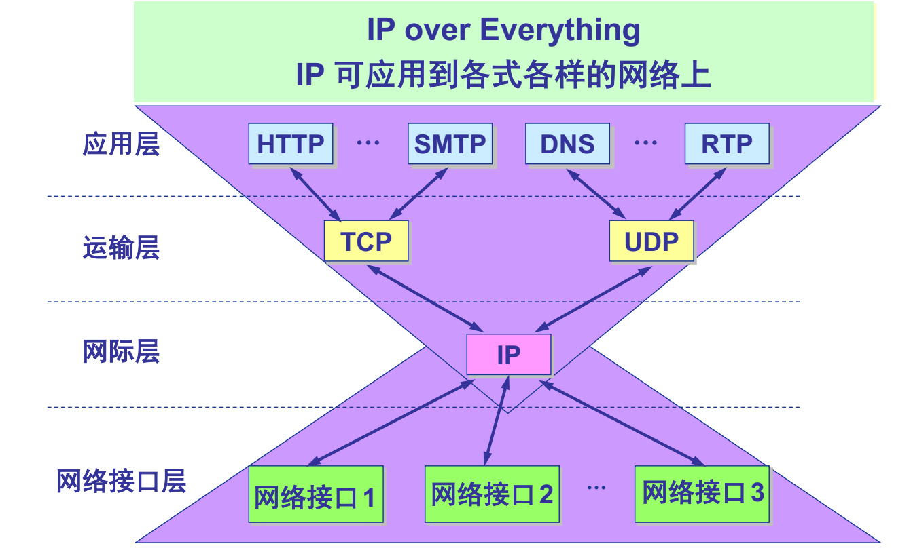
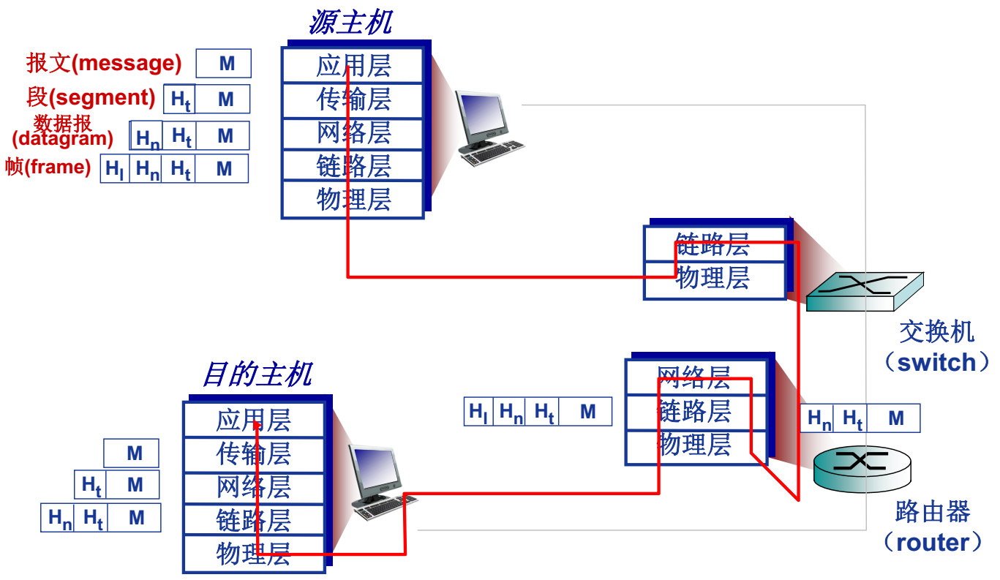

# 哈工大计算机网络spoc笔记

[TOC]

# L10OSI与Internet参考模型

## OSI参考模型

开放系统互连 (OSI)参考模型是由国际标准化组织 (ISO) 于1984年提出的分层网络体系结构模型。目的是支持异构网络系统的互联互通。

- 异构网络系统互连的国际标准
- 理解网络通信的最佳学习工具（理论模型），市场失败
- 7层划分

### OSI参考模型解释的通信过程

- 协议控制层次之间数据的逻辑传输，使用虚线表示；实际信息传输是通过传输介质实现的，传输使用实线表示。
- 中间系统只需要网络层、数据链路层、物理层
- 主机需要全部7层。

### OSI参考模型数据封装与通信过程

- 发送方各层次依据协议附加头部信息，逐层向下递增
- 接收方个层次按协议拆解、解析头部，逐层向上递减
- 物理层不会再对数据加工

### 为什么需要数据封装？

- 增加**控制信息**
  - 构造协议数据单元 (PDU)
- 控制信息主要包括:
  - **地址**（Address） : 标识发送端/接收端
  - **差错检测编码**（Error-detecting code） : 用于差错检测或纠正
  - **协议控制**（Protocol control） : 实现协议功能的附加信息，如: 优先级（priority）、服务质量（QoS）、 和安全控制等

## 层次功能介绍

### 物理层功能

提供基本的比特流传输服务，并不能稳定的进行数据传输，需要数据链路层的辅助。

- 接口特性
  - 机械特性、电气特性、功能特性、规程特性
- 比特编码：如何表示0如何表示1
- 数据率：物理层上数据传输速率
- 比特同步：保证发送接收同步
  - 时钟同步
- 传输模式
  - 单工（Simplex）：单向通信
  - 半双工（half-duplex）：交替进行，同一时刻只能单向通信（对讲机）
  - 全双工（full-duplex）：同一时刻能双向通信

### 数据链路层功能

为网络层提供高质量的数据传输功能。

- 负责物理链路**直接相连的两个节点**之间的数据传输，结点-结点（node-to-node）数据传输。注意物理层不会再加头尾，物理层发的只是比特，数据链路层保证为网络层提供高质量的数据交换服务，物理层只是实现比特传输。

- **组帧（Framing）**，发送数据时将来自网络层的数据加头加尾。了使传输中发生差错后**只将有错的有限数据进行重发**，数据链路层将比特流组合成以帧为单位传送。
- **差错控制**：检测并重传损坏或丢失帧，并避免重复帧。常见的是校验码。
- **帧同步**：帧的组织结构必须设计成使接收方能够 明确地从物理层收到的比特流中对其进行识别，也即能从比特流中区分出帧的起始与终止，这就是帧同步要解决的问题。
- **物理寻址**（Physical addressing）：在帧头中增加发送端和/或接收端的物理地址标识数据，物理层并不能很好的控制比特流接受对象，很可能接受方是无筛选的，这时候就需要增添物理地址来告诉接收方该数据是否是以其为对象的。
- **流量控制（Flow control）**：匹配发送接受端的带宽，避免淹没接收端造成拥塞或丢包。
- **访问(接入)控制（Access control）**：对于共享的数据链路，在任一给定时刻决定哪个设备拥有链路（物理介质）控制使用权。

### 网络层功能

传输层和数据链路层之间。保证网络上的数据传输。

- **逻辑寻址（Logical addressing）**：**全局唯一逻辑地址**，确保数据分组被送达目的主机，如IP地址。**物理寻址在不同网络**中不具有唯一性，无法在多网络中有效寻址。
- **路由**：路线选择
- **分组转发** ：分组转发数据

### 传输层功能

负责源-目的（端-端）（进程间）完整报文传输

- 报文的分段重组
- **SAP寻址（业务接入点）**：其头部有源-目的进程号、端口号、其他类型SAP号
- **连接控制**：端-端逻辑连接的建立维护拆除
- **流量控制（可选）**：匹配发送接受速度问题
- **差错控制（可选）**：差错、纠错

### 会话层功能

在osi中功能非常少，**实际应用上没有这一层**

- **对话控制**：建立维护
- **同步**：在数据流插入“同步点”

### 表示层功能

处理两个系统间**交换信息的语法与语义**（syntax and semantics ） 问题，**实际应用上没有这一层**

- 数据表示转化
  - 转换为主机独立的编码
- 加密/解密
- 压缩/解压缩

### 应用层功能

**帮助用户**通过用户代理（如浏览器）或网络接口**使用网络应用**

典型应用层服务：

- 文件传输（FTP）
- 电子邮件（SMTP）
- Web（HTTP）

## TCP/IP参考模型

先实践后整理，不同于osi先理论后实践

IP可用于任何网络接口层，这也是TCP/IP得以快速发展的原因之一。

## 5层参考模型

**综合 OSI (理论清晰)和 TCP/IP 的优点(实用)**，实用最广泛的参考模型，课程讲解也是用该模型。

- **应用层**: 支持各种网络应用
  - FTP, SMTP, HTTP
- **传输层**: 进程-进程的数据传输
  - TCP, UDP
- **网络层**: 源主机到目的主机的数据分组路由与转发
  - IP协议、路由协议等
- **链路层**: 相邻网络元素（主机、交换机、路由器等）的数据传输
  - 以太网（Ethernet）、 802.11 (WiFi)、PPP
- **物理层**:比特传输

### 5层模型的数据封装

注意，交换机只有链路层和物理层，而路由器还有网络层，即交换机无法在多网络间传播。