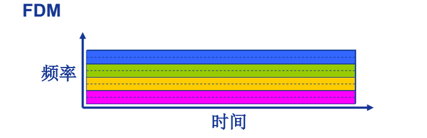
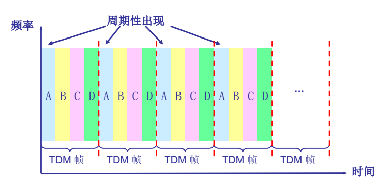
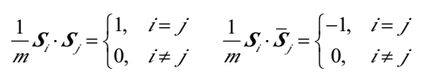
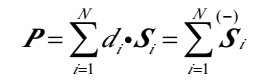
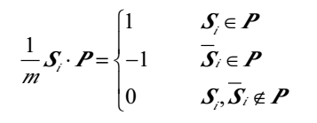

# L06多路复用

**多路复用(Multiplexing)**：

1. 链路/网络资源划分为“资源片”将资源片分配给各路“呼叫”（calls）
2. 每路呼叫独占分配到的资源片进行通信
3. 资源片可能“闲置” 

## 分类

频分多路复用( frequency division multiplexing-FDM )
时分多路复用( time division multiplexing-TDM )
波分多路复用(Wavelength division multiplexing-WDM)
码分多路复用( Code division multiplexing-CDM )

## FDM

频分多路复用的各用户占用不同的带宽资源（请注意，这里的“带宽”是频率带宽（单位： Hz） 而不是数据的发送速率），带宽这一词会多次出现，在不同的语境下分别表示频率的范围或数据传输速率。

被分配的资源就是频率带宽。

## TDM

时分复用则是将时间划分为一段段等长的时分复用帧（TDM 帧），每个用户在每个 TDM 帧中占用固定序号的时隙，每用户所占用的时隙是周期性出现（其周期就是TDM 帧的长度）

## WDM

波分复用就是光的频分复用

## CDM

码分多路复用利用正交向量的特殊数学性质完成多路数据合并，链路传输合并数据，各路使用自己的正交向量来对合并数据解码，以此实现多路复用。

每 个 用 户 分 配 一 个 唯 一 的 m bit 码 片 序 列 (chipping sequence)， 其中“0” 用“-1” 表示、 “1” 用“+1” 表示， 例如：

​	S 站的码片序列： (–1 –1 –1 +1 +1 –1 +1 +1)各用户使用相同频率载波， 利用各自码片序列编码数据，编码信号 = (原始数据) × (码片序列)。

如发送比特 1（+1） ， 则发送自己的 m bit 码片序列

如发送比特 0（-1） ， 则发送该码片序列的m bit 码片序列的反码

各用户码片序列相互正交(orthogonal)

若{di}为原始数据序列，叠加向量为

解码：码片序列与编码信号的内积

