# L01什么是计算机网络

[TOC]

## 计算机网络

计算机网络=通信技术+计算机技术=一种通信网络

**定义**：互连的、 自治（无主从关系）的计算机集
合。

**构成**：由交换网络互连主机

- 主机(hosts)=端系统（end systems）
  - 运行各种网络应用
- 交换网络
  - 交换节点：路由器或交换机
  - 通信链路
    - 光纤, 铜缆, 无线电,卫星……

## Internet

全球最大的互联网络，由ISP(Internet Service Provider互连而成的“网络之网络”

# L02什么是网络协议？

## 定义

网络协议(network protocol)是为进行网络中的数据交换而建立的规则。

## 内容

协议规定了通信实体之间所交换消息的格式==、 意义==以及针对收到信息或发生的事件所应采取的“动作” 、 顺序

### 三要素

语义规定了通信，语法表示具体实现方式，时序表示通信

- ==语义（Semantics）==
  - 通信双方应当做什么
  - 需要发出何种控制信息，以及信息含义（收到特定信息需要完成的动作与做出什么样的响应）。 
- 语法（Syntax）
  - 规定信息格式 
  - 用户数据与控制信息的结构与格式
- 时序（Timing）
  - 事件发生顺序
  - 发生的事件所应采取的“动作” 

# L03计算机网络结构

## 网络边缘

**主机（端系统）**位于网络边缘，运行网络应用程序。

> 客户/服务器(client/server)应用模型：客户发送请求，接收服务器响应
>
> 对等(peer-peer, P2P)应用模型:无（或不仅依赖）专用服务器通信在对等实体之间直接进行

## 接入网络

将网络边缘接入核心网的中介网络。

两种FDM+非对称接入网

### 数字用户线路==DSL==

利用已有的电话线连接中心局的DSLA

- 数据通信通过DSL电话线接入Internet
- 语音（电话）通过DSL电话线接入电话网
- ==非对称==接入网络，上行速度远慢于下行
- ＦＤＭ
  - ==50kHz-1MHz高速下行==
  - ==4kHz-50kHz中速上行==
  - ==0-4kHz电话信道==

### HFC混合光纤同轴（不同于电话线）

- ==利用已有的有线电视线（同轴电缆），用户连接起来，同轴电缆和光纤通过光纤结点连接，光纤进入internet。所以成为混合光纤同轴==
- FDM
- 非对称，非对称就是上下行速度不同，这里DOCSI2.0定义
  - 下行42.8Mbps
  - 上行30.7Mbps

### 光纤到户

就是直接光纤，没有电缆了，详见书

### 无线接入网络

通过共享的<u>无线接入网络</u>连接端系统与路由器

- 通过基站（base station）或称为“接入点”（access point）
- 无线局域网（LANs） 
- 广域无线接入

## 网络核心（核心网络）

互联的路由器或交换机构成的网络

### 关键功能:routing+forwarding

- 路由：确定分组从源到目的传输路径
- 转发：确定路径后的发送动作

# L04Internet结构

结构非常复杂当前Internet结构无人能给出精确描述，下面给出一个基本描述图像：

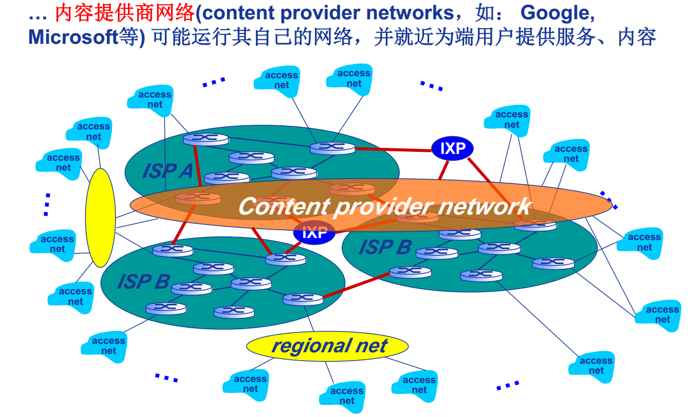

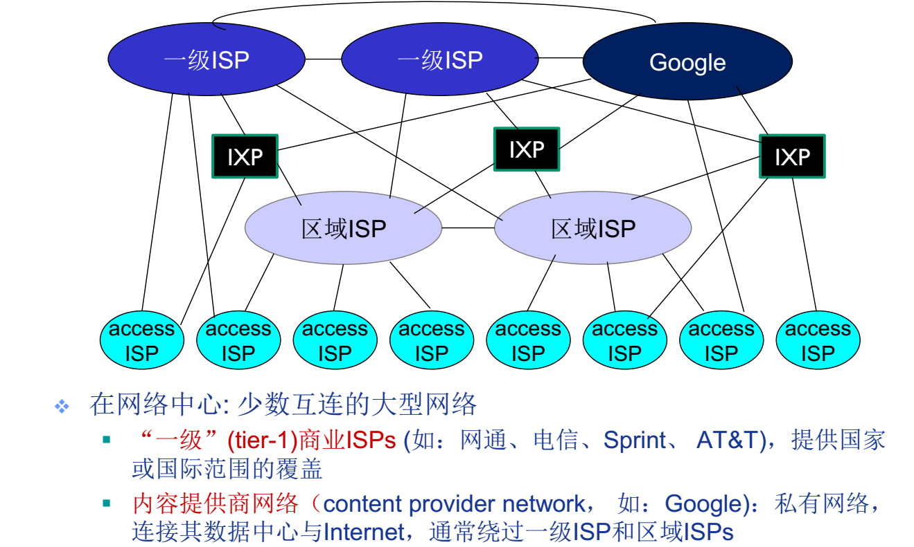

1. **多层次的isp**将全球的边缘网络组织起来。
2. ==由于政治经济因素，**顶层isp不唯一**。==
3. 各个**isp通过ixp** internet exchange point作为交换节点，以**对等链路**（peering link）图中为红线相连接，或直接以对等链路连接，对等的各方不一定在上述图中是同级别的。==对等的多方之间的数据交换不会产生上下级ISP产生的收费行为，便于数据交换。==
4. ~~除了各个主机，还==有regional net区域网络也是接入者之一==，即主机不之间接入网络。这是错误的！！~~
   1. 更正：regional ISP是接入网络的一部分，其由==多种层次，且同层次多个相互竞争==，就像以及ISP一样，==顶级区域ISP向一级ISP申请服务==，并提供服务给连接它的~~主机~~==接入ISP（regional ISP不为主机提供服务！！）==和次级regional ISP。然会次级regional ISP下可能还有次次级regional ISP。~~主机~~接入ISP也能直接向一级ISP申请服务。regional ISP和局域网不同，注意区分。
5. ==接入ISP==：直接为主机或端系统提供接入核心网络功能的ISP，可能是本地电信运营商，也可能是公司、学校。是网络核心的最边缘，是交换服务的纯粹使用者。
6. **==内容提供商网络==**(content provider networks），如： Google,Microsoft等) ，构建自己的独立与internet的网络来与较低层 ISP相连，连接方式可能是通过peer、IXP，也可能收费。这样就越过了收费高的高层ISP，除此之外它也连接一级ISP来和独立网络辐射不到的主机互连。

> **Q：Internet是全球最大的互联网络，其网络拓扑结构极其复杂，而且具有很强的动态性，有很多研究机构或研究团队在开展网络拓扑结构发现相关问题研究。请大家搜索阅读相关文献，并讨论实现网络拓扑发现的意义有哪些？** 
>
> **A：**网络拓扑图形中能更直观明了的看清楚网络中各个节点之间的链接，还有接口之间的链接，也就是反应网络中各实体间的结构关系，这样方便配置和排除错误。网络拓扑设计地好坏对整个网络的性能和经济性有重大影响。
>
> 来源：百度百科
>
> 网络管理的目的是通过监视和控制复杂的计算机网络，最大限度地保证其正常运行，并且要提高效率、降低成本。而网络拓扑发现则是配置管理的核心，故障和性能管理的基础，同时它也是衡量一个商业网络管理系统成败的重要尺度。因此拓扑发现算法的设计在整个网管系统的开发中有着举足轻重的地位。
>
> 网络拓扑发现的应用：
>
> (1)模拟网络：为了模拟实际网络，必须首先得到该网络的拓扑结构；
>
> (2)网络管理:涉及到配置管理、性能管理、故障管理,具体地说,网络拓扑信息可帮助网络管理者确定优化网络配置：测试和判断网络性能,发现网络瓶颈所在
>
> 和失效的链路；
>
> (3)服务器定位:网络拓扑信息可帮助用户确定自身在网络中的位置，从而确定服务器的位置，以及选择哪一个网络服务提供商可以将时延最小化、可用带宽最大化；
>
> (4)为与拓扑结构相关的算法的性能改进提供依据；
>
> (5)为Internet流量工程(traffic engineering)和网络行为学的研究提供基础辅助依据。
>
> 来源：（中国知网）庄锁法, 龚俭.网络拓扑发现综述[J].计算机技术与发展, 2007, 17 (10) :80-91.

# L05数据交换-电路交换

## 数据交换

我们这里讨论的数据交换是核心网络实现互联互通功能的主要手段，即设立中介路由器或交换机。

### 为什么要使用数据交换

如果直连的话是O(n^2)  的。必须提高线路复用率。

### 数据交换类型

电路交换

报文交换

分组交换

## 电路交换

直接在两点之间建立物理线路来完成交换。资源

对于多路占用的物理链路，如果每回只有一个路能使用则需要频繁的物理接点调整，因此使用多路复用技术使得一条物理线路能被多路使用。

# L06多路复用

**电路多路复用(Multiplexing)**：

1. 链路/网络资源划分为“资源片”将资源片分配给各路“呼叫”（calls）
2. 每路呼叫独占分配到的资源片进行通信
3. 资源片可能“闲置” 

## 分类

频分多路复用( frequency division multiplexing-FDM )
时分多路复用( time division multiplexing-TDM )
波分多路复用(Wavelength division multiplexing-WDM)
码分多路复用( Code division multiplexing-CDM )

## FDM

频分多路复用的各用户占用不同的带宽资源（请注意，这里的“带宽”是频率带宽（单位： Hz） 而不是数据的发送速率），带宽这一词会多次出现，在不同的语境下分别表示频率的范围或数据传输速率。

被分配的资源就是频率带宽。

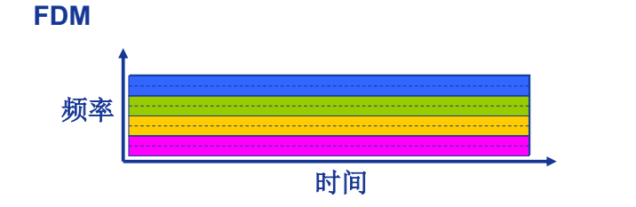

## TDM

时分复用则是将时间划分为一段段等长的时分复用帧（TDM 帧），每个用户在每个 TDM 帧中占用固定序号的时隙，每用户所占用的时隙是周期性出现（其周期就是TDM 帧的长度）

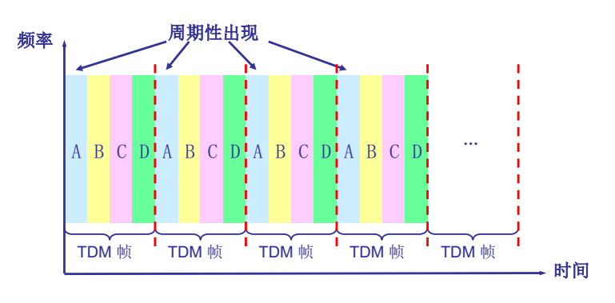

## WDM

波分复用就是光的频分复用

## CDM

码分多路复用利用正交向量的特殊数学性质完成多路数据合并，链路传输合并数据，各路使用自己的正交向量来对合并数据解码，以此实现多路复用。

每 个 用 户 分 配 一 个 唯 一 的 m bit 码 片 序 列 (chipping sequence)， 在CDM中，我们理论上的码片和发送消息，都是+1-1,实现上机器码的0表示-1,1表示+1，这样来完成消息的承载，但是还是当作-1+1来编码解码，相当于我们使用的是-1+1计算机而非01计算机。例如：

	S 站的码片序列： (–1 –1 –1 +1 +1 –1 +1 +1)各用户使用相同频率载波， 利用各自码片序列编码数据，编码信号 = (原始数据) × (码片序列)。

如发送比特 1（+1） ， 则发送自己的 m bit 码片序列

如发送比特 0（-1） ， 则发送该码片序列的m bit 码片序列的反码

各用户码片序列相互正交(orthogonal)

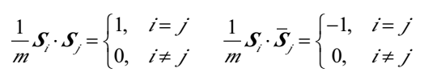

若{di}为原始数据序列，叠加向量为

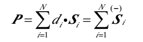

解码：码片序列与编码信号的内积

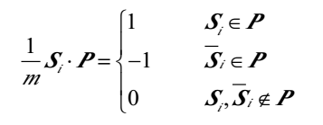

# L07数据交换-报文交换、分组交换

报文交换和分组交换都是基于存储转发的。

## 报文交换

其实非常简单，就是指把信息打包，一次性发送。打包的信息叫做**报文**

## 分组交换

报文交换的改进版，把报文拆成较小的数据包，分开传送，再重新组装。

==和报文交换区别==：

- 需要==拆分重组==
- 数据包要额外包头
- 可并行传送

### 统计多路复用

分组交换使用统计多路复用。

统计多路复用即路由器将接收到的数据包加入缓存队列，逐一发送，那么多个主机发送的数据包，路由器并不区分，只是接受并发送，谁发的快，路由器就更可能下一个发送其数据包，即表现统计倾向。

不像电路分组的多路复用，统计多路复用是一种按需共享的动态复用技术。

==对于转发先后，是谁先完成检验谁先进入队列，而不是谁先开始检验谁先进入队列，因为检验包括确定传输链路。==

## 报文交换vs分组交换

### 存储转发下差异

报文交换与分组交换均采用存储-转发交换方式

- 报文交换以完整报文进行“存储-转发”
  - 需要更大的路由器缓存
  - 串行发送
  - 不需要额外时间拆分合并
  - 无文件头
- 分组交换以较小的分组进行“存储-转发”
  - 路由器缓存要求低
  - 并行发送
  - 需要额外时间来拆分合并
  - 附加额外文件头

### 报文交付时间差异

报文: M bits
链路带宽 : R bps
分组长度（大小） : L bits
跳步数: h
路由器数: n=h-1

T分组交换=M/R+(h-1)L/R=M/R+nL/R

T报文交换=hM/R

由于分组交换的并行发送机制，使得路由器的带宽利用率被提高。

## 分组交换vs电路交换

两者的区分主要在于分组交换的存储转发机制以及拆分合并传输。

- 由于**分组转发**是统计多路复用，因此相比电路交换的独占多路复用能够更灵活的分配物理链路资源，**允许更多用户同时使用网络。**
- 分组转发适用于突发数据传输网络
- ==**分组转发**，当路由器接受过多内容导致缓存填满时会丢弃后续数据包，产生**数据丢失**。队列等待也会产生**传输延迟**。需要协议处理可靠数据传输和拥塞控制。==
- 电路交换虽然无法灵活分配资源，但是能够提供稳定低延迟的连接

> **Q:**分组交换是现代计算机网络重要的理论基础之一，也是目前在计算机网络中广泛采用的数据交换技术，存储-转发则是分组交换的基本工作方式。请大家讨论一下，分组交换是否可以采取其他工作方式？有什么样的优缺点？
>
> **A:**
>
> **直通转发（Cut-through Switching）**
>
> 交换机在接收整个帧之前读取目标地址，然后在整个帧到达之前转发帧。此模式减少了传输
>
> 的延迟，但缺少检查，且不支持不同输入输出速率的端口间的数据转发。 其有两种形式，快
>
> 速转发和无碎片转发。
>
> **快速转发（Fast-forward switching）**
>
> 快速转发通过在接收目标地址（帧的前6个字节）后立即转发帧来提供最低级别的延迟。由于
>
> 其不会检查错误，因此可能会出现转发坏帧的情况。虽然这种情况很少发生，并且目标网络
>
> 适配器在收到时会丢弃坏帧，但在具有高冲突率的网络中，这会对可用带宽产生负面影响。
>
> **无碎片转发（Fragment-Free Switching）**
>
> 无碎片转发是直通转发的一种改进形式。在进行转发之前，交换机读取以太网帧的至少64个
>
> 字节，避免转发小于64字节的以太网帧，以此过滤掉冲突片段。但如果频繁发送数据量很小
>
> 的报文，会导致带宽的利用效率低下。

# L08计算机网络性能

## 速率

速率即数据率(data rate)或称数据传输速率或比特率(bit rate)，单位时间（秒）传输信息（比特）量。

单位： b/s（或bps）、 kb/s、 Mb/s、 Gb/s，==$k=10^3$、 $M=10^6$、$ G=10^9$==

## 带宽

网络的“带宽”通常是数字信道所能传送的“最高数据率”，单位： b/s (bps)

> “带宽” (bandwidth)原本指信号具有的频带宽度，即最高频率与最低频率之差，单位是赫兹（Hz）

### ==带宽和速率的区别==

带宽是数字信道的特性，是数字信道传输过程实际的速率的理论上限。

速率是数字信道的使用状态，是其实际数据传输速度。

## 延迟/时延(delay或latency)

该节针对针对目前网络实际选择使用的分组转发讨论。

### 节点处理延迟

信号通过物理链路传送给路由器之后，路由器对接收到的信息进行处理的时间。

- 差错检测，==确定输出链路==。
- 通常< msec，==毫秒级==

### 排队延迟

等待输出链路可用，取决于路由器拥塞程度

R: 链路带宽(bps)
L: 分组长度 (bits)
a: 平均分组到达速率

$流量强度（traffic intensity）= La/R$

- La/R ~ 0: 平均排队延迟很小
- La/R -> 1: 平均排队延迟很大
  - 均态阻塞很大是因为网络传输量的突发性，导致瞬间数据量可能很大，使得一直维持一个较大的阻塞时长。
- La/R > 1: 超出服务能力， 平均排队延迟无限大！

### 传输延迟

链路带宽指的是路由器将存储内容变为物理信号发送的能力，传输延迟指将数据包转换为物理信号发送出路由器的时间。

### 传播延迟

信号离开路由器后，在物理链路上传播的时间，这个和电磁波传输速度、链路长度有关

## 时延带宽积

$时延带宽积 = 传播时延*带宽=d_{prop}*R (bits)$

以带宽为速率传输时，某个瞬间的快照下，物理链路存储的数据量

## 分组丢失（丢包率）

丢包率=丢包数/已发分组总数

- 队列缓存容量有限
- 分组到达已满队列将被丢弃 (即丢包)
- 丢弃分组可能由前序结点或源重发（也可能不重发）

## 吞吐量/率（Throughput）

吞吐量:表示在**发送端与接收端**之间传送数据速率 (b/s)

和带宽不同，带宽只是一端属性。

吞吐量是发送端与接收端链路上**各段链路的带宽最小值**

# L09计算机网络体系结构

## 为什么需要计算机网络体系结构？

计算机网络是一个非常复杂的系统,涉及许多组成部分，需要一种结构来有效的解析、管理整个计算机网络。

## 分层结构

我们使用分层结构来描述计算机网络体系结构。

网络体系结构是从**功能**上描述计算机网络结构，每一层实际上指一个等级的功能。

### 优点

结构清晰，有利于识别复杂系统的部件及其关系

- 模块化的分层易于系统更新、 维护
- 任何一层服务实现的==改变对于系统其它层都是独立==的
- 定义抽象功能而自由具体实现，==利于标准化==

### 缺点

- 过度分层降低效率，提升复杂度
- 各层次的隔离使得==无法通过综合调整改善性能==

> **Q：分层网络体系结构有什么缺点？**
>
> A：由于分层需要定义模块结构，可能导致层间交互不清晰，接口复杂，并且由于每层都要对
>
> 数据进行处理，导致信息交互的时间延长，增加了数据量。另外，由于各个层次隔离，对通
>
> 信的优化和扩展都只能在各个层次进行，无法在整个系统层次讨论。
>
> **Q：在哪些情况下有必要不采用分层结构？**
>
> A：分层结构（模块化）是任何复杂系统的必要实现手段。所以任何成系统的体系都通常存在
>
> 分层结构，不然就会很麻烦。可能在某些极端情况下，不需要分层结构，例如：家里的电灯
>
> 泡和开关，开关传递给电灯泡一个电“信号”（？），电灯泡立即打开（没有软件进行上层的
>
> 处理操作）。而*跨层*体系结构是可以考虑的。
>
> **Q：跨层体系结构的网络设计及其优点？**
>
> A：跨层设计是一种综合考虑协议栈各层次设计与优化并允许任意层次和功能模块之间自由交互信息的方法，在原有的分层协议栈基础上集成跨层设计与优化方法可以得到一种跨层协议栈。跨层设计与优化的优势在于通过使用层问交互，不同的层次可以及时共享本地信息，减少了处理和通信开销，优化了系统整体性能。与传统的分层结构相比，跨层协议栈的层问交互要复杂些，各层需要了解其他层的行为并需要更多的专用接口，降低了通用性。但是，跨层设计方法的各层协议和功能模块的协同有助于消除冗余功能；采用消息驱动的控制方法，任意层之间可以交互信息；针对特定的场合进行集成设计和优化可以较好匹配应用需求和网络条件。例如在无限通信中，考虑到无线信道有限的带宽资源、信道的时变特性以及节点自身的局限性，跨层设计方法优势带来的好处远大于层间交互带来的协议设计复杂性的缺点。
>
> 参考：王海涛,刘晓明 adhoc网络中跨层设计方法的研究 2005

## 计算机网络体系结构

计算机网络体系结构(network architecture)是分层结构：

- 每层遵循某个/些网络协议完成本层功能，功能的依赖构成层次关系。**层即功能，协议是对功能的具体定义。**
- network architecture即计算机网络的**各层及其协议的集合**

### 基本概念：==上下层之间的信息交换叫：同层信息交换叫：临层交换使用什么来实现==（名词解析）

**实体(entity)** ：表示任何可发送或接收信息的硬件或软件进程。同一系统的各个层次分别都是实体，两个不同系统的层次分别都是实体。
**协议**：控制两个**同层**实体进行通信的规则的集合，**协议是“水平的”** 。
**服务**：任一层实体需要**使用下层服务**，遵循本层协议，实现本层功能， **向上层提供服务**，**服务是“垂直的”** 。
**透明**：下层协议的实现对上层的服务用户是透明的。
==**SAP和交换原语**==：同系统的相邻层实体间通过接口进行交互（服务和要求服务），通过服务访问点 SAP(Service Access Point)和交换原语（控制指令），指定请求的特定服务。

# L10OSI与Internet参考模型

## OSI参考模型

开放系统互连 (OSI)参考模型是由国际标准化组织 (ISO) 于1984年提出的分层网络体系结构模型。目的是支持异构网络系统的互联互通。

- 异构网络系统互连的国际标准
- 理解网络通信的最佳学习工具（理论模型），市场失败
- 7层划分

### OSI参考模型解释的通信过程

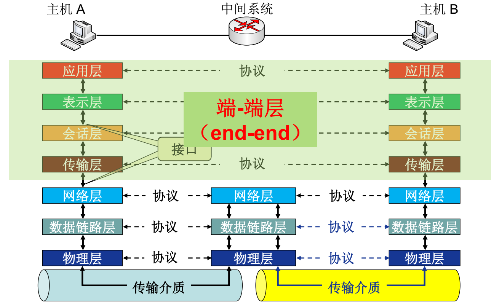

- 协议控制层次之间数据的逻辑传输，使用虚线表示；实际信息传输是通过传输介质实现的，传输使用实线表示。
- 中间系统只需要网络层、数据链路层、物理层
- 主机需要全部7层。
- 物理交换机只有物理层和链路层，路由器还有网络层

### 更详细的OSI参考模型数据封装与通信过程

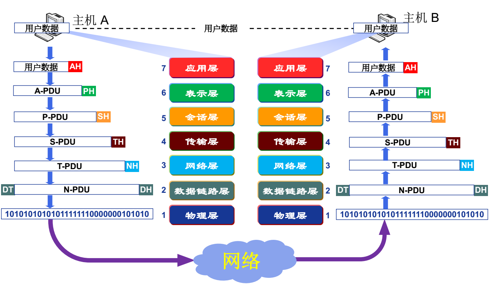

- 发送方各层次依据协议附加头部信息，逐层向下递增
- 接收方个层次按协议拆解、解析头部，逐层向上递减
- 物理层不会再对数据加工
- 数据链路层是唯一一个在两头添加的层

### ==数据封装增加了哪些信息==？

- 为了增加**控制信息**
  - 控制信息主要包括:
    - **地址**（Address） : 标识发送端/接收端
    - **差错检测编码**（Error-detecting code） : 用于差错检测或纠正
    - ==**协议控制**==（Protocol control） : 实现协议功能的附加信息，如: 优先级（priority）、服务质量（QoS）、 和安全控制等
  - ==控制信息的添加构造了协议数据单元 (PDU)，两者是同一行为的两种解释==
    - 协议数据单元PDU（Protocol Data Unit）是指对等层次之间传递的数据单位。 
    - 协议数据单元(Protocol Data Unit )物理层的 PDU是数据位（bit），
    - 数据链路层的 PDU是数据帧（frame），
    - 网络层的PDU是数据包（packet），
    - 传输层的 PDU是数据段（segment），
    - 其他更高层次的PDU是报文（message）。

## 层次功能介绍

### 物理层功能

提供基本的比特流传输服务，并不能稳定的进行数据传输，需要数据链路层的辅助。

PDU：bit

- 接口特性
  - 机械特性、电气特性、功能特性、规程特性
- 比特编码：如何表示0如何表示1
- 数据率：物理层上数据传输速率
- 比特同步：保证发送接收同步
  - 时钟同步
- 传输模式
  - 单工（Simplex）：单向通信
  - 半双工（half-duplex）：交替进行，同一时刻只能单向通信（对讲机）
  - 全双工（full-duplex）：同一时刻能双向通信

### 数据链路层功能

为网络层提供高质量的数据传输功能。

PDU：数据帧

- 负责物理链路**直接相连的两个节点**之间的数据传输，结点-结点（node-to-node）数据传输。注意物理层不会再加头尾，物理层发的只是比特，数据链路层保证为网络层提供高质量的数据交换服务，物理层只是实现比特传输。

- ==功能==
  - **物理寻址**（Physical addressing）：在帧头中增加发送端和/或接收端的物理地址标识数据，物理层并不能很好的控制比特流接受对象，很可能接受方是无筛选的，这时候就需要增添物理地址来告诉接收方该数据是否是以其为对象的。
  - **差错控制**：检测并重传损坏或丢失帧，并避免重复帧。常见的是校验码。和传输层差错控制不同
  - **流量控制（Flow control）**：匹配发送接受端的带宽，避免淹没接收端造成拥塞或丢包。
  - **访问(接入)控制（Access control）**：对于共享的数据链路，在任一给定时刻决定哪个设备拥有链路（物理介质）控制使用权。

- 具体实现

  - **组帧（Framing）**，发送数据时将来自网络层的数据加头加尾。了使传输中发生差错后**只将有错的有限数据进行重发**，数据链路层将比特流组合成以帧为单位传送。**组帧，即构造PDU是为了实现物理寻址、差错控制、流量控制、访问接入。**
  - **帧同步**：帧的组织结构必须设计成使接收方能够 明确地从物理层收到的比特流中对其进行识别，也即能从比特流中区分出帧的起始与终止，这就是帧同步要解决的问题。**帧同步是为了组帧能顺利使用。**

### 网络层功能

传输层和数据链路层之间。保证网络上的数据传输。

PDU：数据包

- **逻辑寻址（Logical addressing）**：**全局唯一逻辑地址**，确保数据分组被送达目的主机，如IP地址。**物理寻址在不同网络**中不具有唯一性，无法在多网络中有效寻址。
- **路由**：路线选择
- **分组转发** ：分组转发数据
- 无差错控制功能

### 传输层功能

负责源-目的（端-端）（进程间）完整报文传输

PDU：数据段

- 报文的分段重组
- **SAP寻址（业务接入点）**：其头部有源-目的进程号、端口号、其他类型SAP号
- **连接控制**：端-端逻辑连接的建立维护拆除
- **流量控制（可选）**：匹配发送接受速度问题
- **差错控制（可选）**：差错控制：丢包解决。和数据链路层的差错控制并不同。传输层要向会话层提供通信服务的可靠性，避免报文的出错、丢失、延迟时间紊乱、重复、乱序等差错。
- 主要的协议是：TCP、UDP。

### 会话层功能

会话层为客户端的应用程序提供了**打开、关闭和管理会话的机制，**亦即半永久的对话。会话的**实体**包含了对其他程序作会话链接的要求及回应其他程序提出的会话链接要求。在

在osi中功能非常少，**实际应用上没有这一层**

PDU：报文

- **对话控制**：建立维护
  - ==认证==
  - ==权限==
  - 会话恢复（同步）：在数据流插入“同步点”（session）

### 表示层功能

**表示层**(Presentation)为不同终端的上层用户提供数据和信息正确的**语法表示变换方法。**

PDU：报文

- 数据表示转化
  - 转换为主机独立的编码
- ==加密/解密==
- ==压缩/解压缩==

### 应用层功能

**帮助用户**通过用户代理（如浏览器）或网络接口**使用网络应用**，应用层直接和应用程序接口并提供常见的网络应用服务。

PDU：报文

典型应用层服务：

- 文件传输（FTP）
- 电子邮件（SMTP）
- Web（HTTP）

## TCP/IP参考模型

先实践后整理，不同于osi先理论后实践

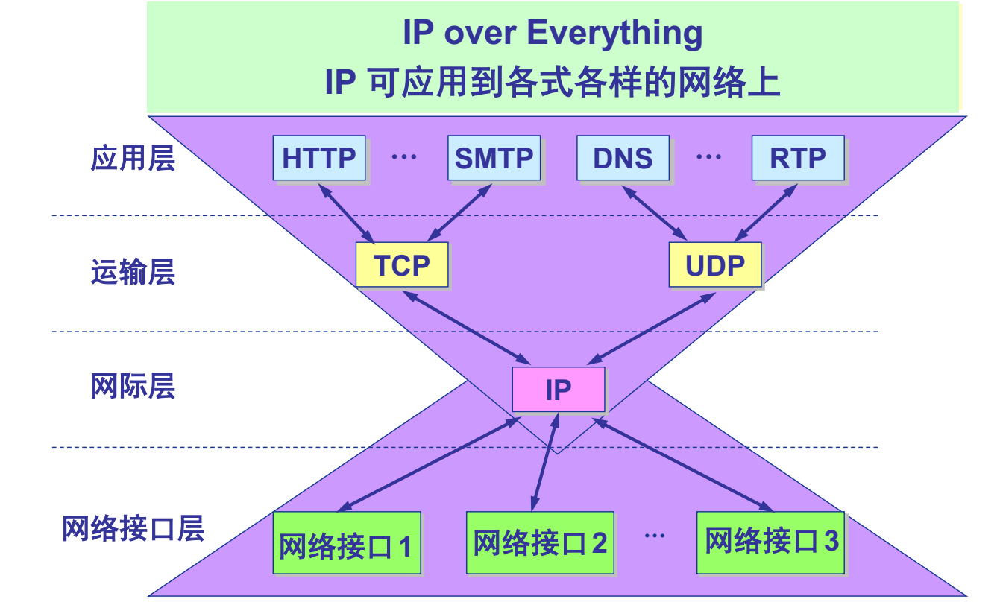

IP可用于任何网络接口层，这也是TCP/IP得以快速发展的原因之一。

### 应用层

通常人们认为OSI**模型的最上面三层（应用层**、表示层和会话层）在TCP/IP组中是一个应用层。

### 传输层

即OSI中传输层

### 网络互连层

*TCP/IP协议族中的\**网络互连层**（internet layer）在OSI模型中叫做**网络层**（network layer）。*

### 网络接口层

数接链路层和物理层。但是也有不同

网络接口层实际上并不是因特网协议组中的一部分，但是它是数据包从一个设备的网络层传输到另外一个设备的网络层的方法。然而，链路层并不经常这样简单。它也可能是一个虚拟专有网络（VPN）或者隧道，在这里从网络层来的包使用隧道协议和其他（或者同样的）协议组发送而不是发送到实体的接口上。

## 5层参考模型

**综合 OSI (理论清晰)和 TCP/IP 的优点(实用)**，实用最广泛的参考模型，课程讲解也是用该模型。

- **应用层**: 支持各种网络应用
  - FTP, SMTP, HTTP
- **传输层**: 进程-进程的数据传输
  - TCP, UDP
- **网络层**: 源主机到目的主机的数据分组路由与转发
  - IP协议、路由协议等
- **链路层**: 相邻网络元素（主机、交换机、路由器等）的数据传输
  - 以太网（Ethernet）、 802.11 (WiFi)、PPP
- **物理层**:比特传输

### 5层模型的数据封装

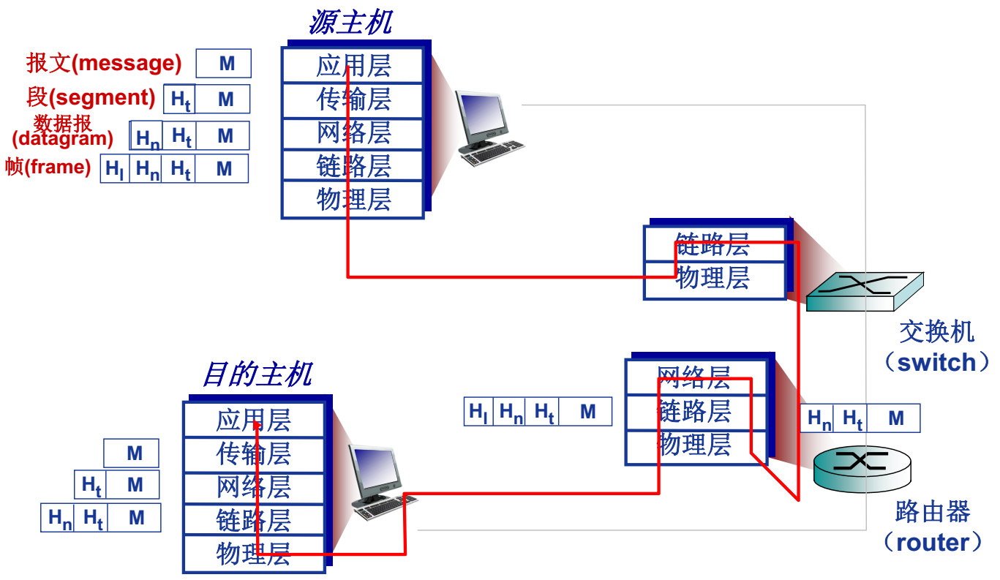

==注意，交换机只有链路层和物理层，而路由器还有网络层，即**交换机无法在多网络间传播**。==

**==交换机无法在多网络间传播==**

**==交换机无法在多网络间传播==**

