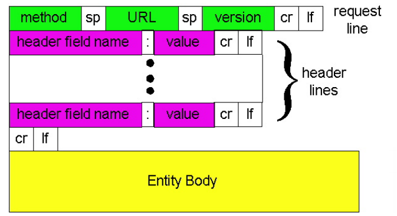
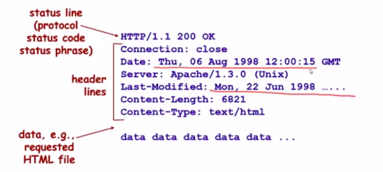
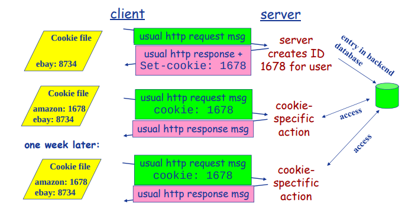
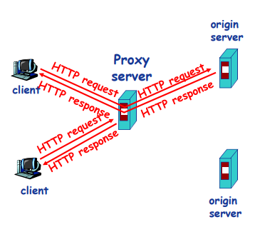
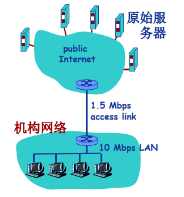

# 2.3Web应用

# web应用概述

## Web与HTTP

- web万维网是基于HTTP的Inernet因特网**网络服务**。
- Internet将资源组织起来形成网络，web的功能是为用户提供**资源索引展示服务**。
- web将资源以**URL定位**，**使用超文本和超链接将资源连接起**来，是一个**由许多互相链接的超文本组成的系统**。
- **超文本**是包含超链接的文本，允许从当前阅读位置直接切换到超链接所指向的文本、图像、音视频、文件等等。超链接就是指向其他资源的连接。

- 网页：超文本（如html）经浏览器解析渲染展现为网页
- 网页互相链接：（准确的说是网页的源相互连接）

- 网页(Web Page)包含多个对象(objects)
  - 基本HTML文件：包含对其他对象引用的链接
  - 对象：HTML文件、JPEG图片、视频文件、动态脚本等
- **对象的寻址(addressing)**
  - URL(Uniform Resoure Locator)：统一资源定位器 RFC1738
    - 格式： Scheme://host:port/path
    - 例如：http://www.hit.edu.cn/header/article.txt

## HTTP协议概述

**HTTP，原名超文本传输协议，HyperText Transfer Protocol，是web万维网遵守的协议之一。**功能是：建立web服务器和本地客户端（通常是浏览器）之间的数据交换。

- **端口号：80**

- **http网络结构：C/S结构**
  - 客户—Browser：请求、接收、展示Web对象
  - 服务器—Web Server：响应客户的请求，发送对象
- HTTP版本：
  - 1.0： RFC 1945
  - 1.1： RFC 2068

- **http传输层协议：TCP传输协议**
  - 服务器在80端口等待客户的请求
  - 三次握手后，客户端浏览器建立起到服务器的TCP连接
  - 浏览器(HTTP客户端)与Web服务器(HTTP服务器)交换HTTP消息
  - 四次握手，关闭TCP连接
- **无状态(stateless)**，即无记录
  - 服务器不记录任何有关客户端过去所发请求的信息

    - 有状态的协议**更复杂**:
      - 需维护状态(历史信息)
      - 如果客户或服务器失效，会产生状态的不一致，**解决这种不一致代价高**
  - web通过cookie、session技术来实现状态存储功能。

# HTTP连接

## HTTP连接的两种类型

- **非持久性连接(NonpersistentHTTP)**
  - **每个TCP连接最多允许传输一个对象**
  - HTTP 1.0版本（早期）使用非持久性连接
- **持久性连接(Persistent HTTP)**
  - **每个TCP连接允许传输多个对象**
  - HTTP 1.1版本默认使用持久性连接

### 非持久性连接

#### 流程

假定用户在浏览器中输入URLwww.someSchool.edu/someDepartment/home.index（包含文本和指向10个jpeg图片的链接）

1. 服务器等待TCP连接中
2. 客户端使用socket申请tcp连接。
3. 三次握手完成建立，在第三次握手同时传输Http请求信息。
4. HTTP服务器收到请求消息，解析，产生包含所需要对象的响应消息，并通过套接字发给客户端。HTTP服务器通知tcp连接断开。（不过客户端收到响应后才真正断开）
5. 当客户端收到响应，tcp连接断开，解析html文件，显示html文件，发现有10个指向jpeg对象的超连接。
6. 为每个jpeg对象重复步骤1-5。而不能接着上次的TCP连接继续交流。

#### 时延

- **单位：RTT(Round Trip Time)**
  - 从客户端发送一个**很小**的数据包到服务器**并返回**所经历的时间
- **响应时间(Response time)**
  - tcp三次握手前两次：1RTT
  - tcp三次握手第三次+发送HTTP请求消息：0.5RTT，这里之所以不是1RTT是因为tcp三次握手第三次+发送HTTP请求消息同时发送。而不是等但三次握手完成再发送请求。
  - HTTP接受请求--HTTP响应消息的前几个字节到达：0.5个RTT
  - 响应消息中所含的文件/对象传输时间
  - **Total=2RTT +文件发送时间**

#### 非持久性连接的问题

- **每个对象需要2个RTT**：1+0.5+0.5
- 操作系统需要为每个TCP连接**开销资源(overhead)**，同时刻创建大量的连接。
- 浏览器会怎么做？
  - 打开多个并行的TCP连接以获取网页所需对象
  - 给服务器端note造成恶劣的影响，**高密度tcp请求耗尽资源**。

### 持久性HTTP

- 持久性连接
  - **发送响应后，服务器保持TCP连接的打开**
  - 后续的HTTP消息可以通过这个连接发送

- **无流水(pipelining)的持久性连接**
  - **客户端只有收到前一个响应后才发送新的请求**
  - 每个被引用的对象耗时1个RTT
- **带有流水机制的持久性连接**
  - HTTP 1.1的默认选项
  - **客户端只要遇到一个引用对象就尽快发出请求**
  - 理想情况下，收到所有的引用对象只需耗时约1个RTT
- 这里计算延迟都是忽略了连接建立时间的1RTT！！只考虑申请发送+响应的1RTT！

# HTTP消息格式

- HTTP协议有两类消息
  - 请求消息(request)
  - 响应消息(response)

## HTTP请求消息

请求消息
 使用ASCII书写：人直接可读

GET /somedir/page.html HTTP/1.1     	请求行： 方法+url+http版本

Host: www.someschool.edu			头部行

User-agent: Mozilla/4.0				头部行

Connection: close					头部行

Accept-language:fr					头部行

Cookies								头部行

空行（非常重要，讲请求头和消息体分开）

**消息体**，一般包括要填的表单

### 上传附加输入信息的方法

- POST方法
  - 网页经常需要填写表格(form)
  - 在请求消息的消**息体(entity body)**中上传客户端的输入，entity body在上述的name：value部分之后
- GET方法
  - 使用URL传输，在url后link信息
  - 输入信息通过request行的URL字段上传

### 方法的类型

- HTTP/1.0
  - GET
  - POST
  - HEAD
    - 请Server不要将所请求的对象放入响应消息，常常用来做测试
- HTTP/1.1
  - GET, POST, HEAD
  - PUT
    - 将**消息体**中的文件上传到URL字段所指定的路径
  - DELETE
    - 删除URL字段所指定的文件

## HTTP响应消息

date是生成该响应消息的时间，last-modified是请求的服务器资源（比如某个文件）最后的修改时间。

响应头下一个空行与响应正文分割，响应正文就是申请的内容

### HTTP响应状态代码

响应消息的第一行

示例
 200 OK
 301 Moved Permanently（资源已被永久改变位置）
 400 Bad Request
 404 Not Found
 505 HTTP Version Not Supported

# Cookie技术

## 为什么需要Cookie？

- **HTTP协议无状态，但是很多应用需要服务器掌握客户端的状态**，如网上购物，如何实现？

## Cookie技术

- Cookie技术
  - 某些网站为了**辨别用户身份、进行session跟踪**而**储存在用户本地终端**上的数据（通常经过加密）。
  - RFC6265
- **Cookie的组件**
  - HTTP响应消息的cookie头部行
  - HTTP请求消息的cookie头部行
  - 保存在客户端主机上的cookie文件，由浏览器管理
  - **Web服务器端的后台数据库**
- Cookie和session
  - cookie存储在客户端，持续时间较长
  - session在服务端，持续时间较短，一般只在会话期间和会话结束后一小段时间内存在。

## Cookie的原理

**//TODO** ##############################

技术细节没有涉及到，此处要补充，包括session技术，以及cookie验证机制

## Cookie的作用

- Cookie能够用于：
  - 身份认证
  - 购物车
  - 推荐
  - Web e-mail
- 隐私问题
  - cookie虽然经加密但不是没有破解可能，但是客户端安全性不高，一旦cookie被恶意获取，隐私很可能泄露
  - 网站获应用要求用户提打开cookie功能才能正常访问，暗中记录用户访问信息。

## 思考题

1. Cookie能够怎样被用于收集隐私？
2. 能够收集哪些隐私？
3. 你在上网的时候感觉到自己的隐私
4. 被严重侵犯吗？

# Web缓存/代理服务器技术

## 功能

在不访问服务器的前提下满足客户端的HTTP请求。

## 为什么要发明这种技术？

- 缩短客户请求的响应时间
- 减少机构/组织的流量
- 在大范围内(Internet)实现有效的内容分发

## Web缓存/代理服务器

- 用户设定浏览器通过缓存进行Web访问
- 浏览器向缓存/代理服务器发送所有的HTTP请求
  - 如果所请求对象在缓存中，缓存返回对象
  - 否则，缓存服务器向原始服务器发送HTTP请求，获取对象，然后返回给客户端并存该对象

- 缓存既充当客户端，也充当服务器
- 一般由ISP(Internet服务提供商)架设

## Web缓存示例

- 假定：
  - 对象的平均大小=100,000比特
  - 机构网络中的浏览器平均每秒有15个到原始服务器的请求
  - 从机构路由器到原始服务器的往返延迟=2秒
- 网络性能分析：
  - 局域网(LAN)的利用率=1.5M/10M=15%
  - 接入互联网的链路的利用率=100%
  - 总的延迟=互联网上的延迟+访问延迟+局域网延迟=2秒+几分钟+几微秒

- 解决方案1：
  - **提升互联网接入带宽**=10Mbps
- 网络性能分析：
  - 局域网(LAN)的利用率=15%
  - 接入互联网的链路的利用率=15%
  - 总的延迟=互联网上的延迟+访问延迟+局域网延迟=2秒+几微秒+几微秒
- 问题：
  - **成本太高**

- 解决方案2：
  - 安装Web缓存
  - **假定缓存命中率是0.4**
- 网络性能分析：
  - 40%的请求立刻得到满足
  - 60%的请求通过原始服务器满足
  - 接入互联网的链路的利用率下降到60%，**从而其延迟可以忽略不计**，例如10微秒
  - 总的平均延迟=互联网上的延迟+访问延迟+局域网延迟=0.6×2.01秒+0.4×min微秒<1.4秒
- 问题：
  - 缓存和远端服务器资源是否一致？或者版本是否满足用户要求？

## 条件性GET方法

解决了缓存和远端服务器资源是否一致？或者版本是否满足用户要求？的问题。

**最重要：条件get是代理服务器向原始服务器发送！**

- 目标：
  - 代理服务器向远端服务其的get请求进行设计，告知远端服务器该代理所持资源版本，远端服务器检查后，若是最新版则不发送请求的对象。
- 缓存：
  - 在HTTP请求消息中声明所持有版本的日期
  - If-modified-since: （告诉远端，如果在**日期之后远端资源更改，则发送所请求对象）
- 服务器：
  - 如果缓存的版本是最新的，则响应消息中不包含对象
  - HTTP/1.0 304 Not Modified

## 课后作业

检索文献，分析、总结Web技术近
年来有哪些新进展？其关键思想和
技术是什么？