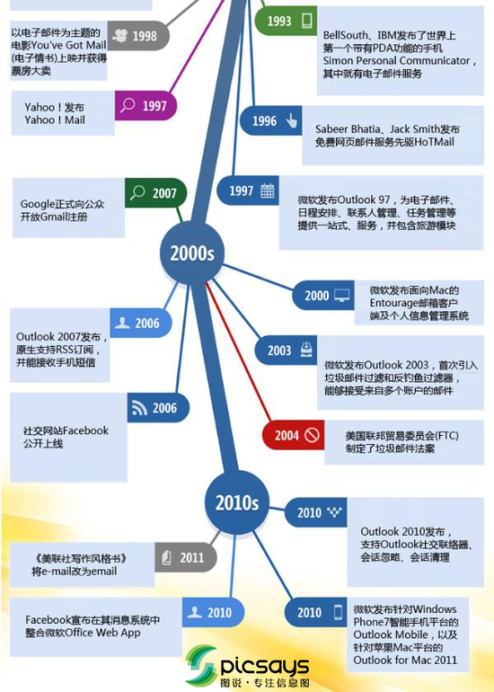

# 2.4Email应用

# Email应用

## Email应用的构成

- Email应用的构成组件
  -  邮件客户端(user agent)：外围
       -  读、写Email消息
       -  与服务器交互，收、发Email消息
       -  Outlook, Foxmail, Thunderbird
       -  Web客户端
  -  邮件服务器：核心
       -  邮箱：存储发给该用户的Email
       -  消息队列(message queue)：存储等待发送的Email
  -  SMTP协议(Simple Mail TransferProtocol)，简单邮件传输协议
       -  邮件服务器之间传递消息所使用的协议
       -  客户端：发送消息的**服务器**
       -  服务器：接收消息的服务器

实现异步发送，自动重试，在线缓存，延时发送等等功能。

## SMTP协议: RFC 2821

SMTP是一个**“推”的协议，**它不允许根据需要从远程服务器上“拉”来消息。要做到这点，邮件客户端必须使用POP3或IMAP。

- 使用TCP进行email消息的可靠传输
- **端口25**
- 传输过程的三个阶段
  -  tcp握手
  -  消息的传输
  -  tcp挥手
- 命令/响应交互模式
  -  命令(command): ASCII文本
  -  响应(response): 状态代码和语句
- E**mail消息只能包含7位ASCII码，因为email系统开发是非常早期的时代**

### 与HTTP对比

-  HTTP: 拉式(pull)
-  SMTP: 推式(push)
-  都使用命令/响应交互模式
-  命令和状态代码都是ASCII码
-  HTTP: 每个对象封装在独立的响应消息中
-  SMTP: 多个对象在由多个部分构成的消息中发送

## 动手尝试SMTP交互

- telnet servername 25
- 服务器返回代码220
- 输入以下命令与SMTP服务器交互
  -  HELO
  -  MAIL FROM
  -  RCPT TO
  -  DATA
  -  QUIT

## 思考题

Email作为互联网上的古老应用，从
出现至今经过了什么样的演变过程？
站在今天的角度看，Email应用有哪
些缺点和不足？请查阅资料，给出你
的见解。

# Email消息格式与POP3协议

## Email消息格式

- SMTP：email消息的传输/交换协议
- RFC 822：文本消息格式标准
  -  头部行(header)
       - To
       -  From
       -  Subject（主题）
  -  空行
  -  消息体(body)
       -  消息本身（只能是ASCII字符）

## Email消息格式：多媒体扩展

- MIME：多媒体邮件扩展 RFC 2045, 2056
  -  通过在邮件头部增加额外的行以声明MIME的内容类型

## 邮件访问协议（不同与STMP协议）

**邮件访问协议：从服务器获取邮件**。Mail Access Protocol

**EMAIL应用使用多个协议完成功能**

-  POP3: Post Office Protocol [RFC 1939]
     - 认证/授权(客户端<-->服务器)和下载
-  IMAP: Internet Mail Access Protocol [RFC 1730]
     -  更多功能
     -  更加复杂
     -  能够操纵服务器上存储的消息
     -  趋势
-  HTTP：163, QQ Mail等。也可以当作一种邮件访问协议

## POP3协议

- 认证过程（两次握手）
  -  客户端命令
       -  User：声明用户名
       -  ass: 声明密码
  -  服务器响应
       -  +OK
       -  -ERR
- 事务阶段
  -  List：列出消息数量
  -  Retr：用编号获取消息
  -  Dele: 删除消息
  -  Quit

- “下载并删除”模式，下载到本地，删除服务器上的信息。POP协议仅支持该模式。
  -  用户如果换了客户端软件，无法重读该邮件
- “下载并保持”模式：不同客户端都可以保留消息的拷贝。**POP3支持，POP不支持**
-  **POP3是无状态的**。客户端的动作不能保存到服务器上。比如删除、移动文件

## IMAP协议

- 有状态协议，**支持CS双向通信**
  - 所有消息统一保存在一个地方：服务器
  - 允许用户利用文件夹组织消息，**删除移动文件服务器会同步**
- IMAP支持跨会话(Session)的用户状态:
  -  文件夹的名字
  -  文件夹与消息ID之间的映射等
- IMAP更好地支持了从多个不同设备中随时访问新邮件。
- IMAP提供的**摘要浏览功能**可以让你在阅读完所有的邮件到达时间、主题、发件人、大小等信息后才作出是否下载的决定。

## Email流程示例

对host：a、b，a发SMTP送邮件m给a的邮件服务器A，A遵循STMP将m发送给b的邮件服务器B，**b使用access protocol来获取B上的信件**

## 课后练习

请查阅资料，比较IMAP与POP3的
不同，并调研主流Email服务对
IMAP协议的支持情况。

1、IMAP提供Webmail 与电子邮件客户端之间的**双向通信**，**客户端收取的邮件仍然保留在服务器上，同时在客户端上的操作都会反馈到服务器上**（如：删除邮件，标记已读等，服务器上的邮件也会做相应的动作。所以无论从浏览器登录邮箱或者客户端软件登录邮箱，看到的邮件以及状态都是一致的。）。**而POP3在客户端的操作不会反馈到服务器上。**

2、I**MAP更好地支持了从多个不同设备中随时访问新邮件。**

3、IMAP提供的**摘要浏览功能**可以让你在阅读完所有的邮件到达时间、主题、发件人、大小等信息后才作出是否下载的决定。

4、POP3需要下载未阅读的**邮件，IMAP可以不用把所有的邮件全部下载，而是通过客户端直接对服务器上的邮件进行操**作。所有通过IMAP传输的数据都会被加密，从而保证通信的安全性。

5、IMAP 整体上为用户带来更为便捷和可靠的体验。**POP3 更易丢失邮件或多次下载相同的邮件。**