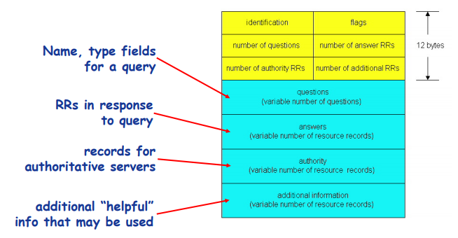

# 2.5DNS服务

# DNS概述

## DNS：Domain Name System

- Internet上主机/路由器的识别问题
  - IP地址
  - 域名：www.hit.edu.cn。是为了方便记忆IP，是面向人类的，IP地址是面向计算机的。
- 域名解析系统DNS：解决问题：域名和IP地址之间如何映射？
  - **多层**命名服务器构成的**分布式**数据库
  - DNS本身也是一个应用层协议
    - • DNS提供Internet核心功能，但是在**应用层使用用应用层协议实现**
    - • 网络边界复杂

- DNS服务具体内容
  - 域名向IP地址的翻译
  - 主机别名
  - 邮件服务器别名
  - 负载均衡：Web服务器，例如轮换web服务器排名
- 问题：为什么不使用集中式的DNS？
  - 单点失败问题
  - 流量问题
  - 距离问题
  - 维护性问题

## 分布式层次式数据库

以迭代查询为例：

- 客户端想要查询www.amazon.com的IP
  - 先向本地DNS申请查询
    - 本地dns查看缓存，有则返回无则继续查询
  - 本地dns查询**根服务器**，找到**com域名解**析服务器
  - 本地dns**查询com域名**解析服务器，**找到amazon.com域名**解析服务器
  - 本地dns查询**amazon.com域名解**析服务器，获**得www.amazon.com的IP**地址
  - 本地dns缓存www.amazon.com的IP，并发送结果给客户端

## DNS根域名服务器

- **根域名服务器**（root name server）是互联网域名解析系统（DNS）中**最高级别**的域名服务器，负责返回**顶级域的权威域名服务器地址**。

  > 在根域名服务器中虽然没有每个域名的具体信息，但储存了负责每个域（如.com,.xyz,.cn,.ren,.top等）的解析的域名服务器

- 本地域名解析服务器无法解析域名时，有一个递归访问过程，起点是根域名解析器

- 全球由13个root dns，中国没有。

  > 由于DNS和某些协议（未分片的[用户数据报协议](https://zh.wikipedia.org/wiki/%E7%94%A8%E6%88%B7%E6%95%B0%E6%8D%AE%E6%8A%A5%E5%8D%8F%E8%AE%AE)（UDP）数据包在[IPv4](https://zh.wikipedia.org/wiki/IPv4)内的最大有效大小为512[字节](https://zh.wikipedia.org/wiki/%E5%AD%97%E8%8A%82)）的共同限制，根域名服务器地址的数量被限制为13个。幸运的是，采用[任播](https://zh.wikipedia.org/wiki/%E4%BB%BB%E6%92%AD)技术架设镜像服务器可解决该问题，并使得实际运行的根域名服务器数量大大增加。截至2017年11月，**全球共有800台根域名服务器在运行。**

## TLD和权威域名解析服务器

- 顶级域名服务器(TLD, top-level domain): 负责com, org, net,edu等顶级域名和国家顶级域名，例如cn, uk, fr等
  - Network Solutions维护com顶级域名服务器
  - Educause维护edu顶级域名服务器
- 权威(Authoritative)域名服务器：权处于DNS服务端的一套系统，该系统保存了某个响应域名的权威信息。权威DNS即通俗上“这个域名我说了算”的服务器。
  - 域名所有者（通常不是个人而是一个组织）负责维护

## 本地域名解析服务器

- 不严格属于层级体系
- 每个ISP有一个本地域名服务器
  - 默认域名解析服务器
- **当主机进行DNS查询时，查询被发送到本地域名服务器，由本地域名服务器先查本地缓存再递归查询**
  - **作为代理(proxy)，将查询转发给（层级式）域名解析服务器系统**

## DNS查询示例

- 完整的递归DNS查询流程需要DNS服务器**从根域名“.”服务器、顶级域名服务器“.com”、一级域名服务器“taobao.com”一级一级递归查下来最终找到权威服务器取得结果，并返回给客户**，同时将取得的结果根据域名设置的**TTL时间**，**缓存**在自己的系统当中，以便下次使用。
- 迭代查询
  - 查询失败，则被查询服务器返回域名解析服务器的名字
  - “我不认识这个域名，但是你可以问这服务器”
  - 重试工作由查询者承担
- 递归查询
  - 将域名解析的任务交给所联系的服务器
  - 重试工作由被查询者承担，形成一个查询链路，每个查询者仅发送一次信息

## DNS记录缓存和更新

- 只要域名解析服务器获得域名—IP映射，即缓存这一映射
  - 一段时间过后，缓存条目失效（删除）
  - **本地域名服务器一般会缓存顶级域名服务器的映射，因此根域名服务器不经常被访问**
- 记录的更新/通知机制
  - RFC 2136
  - Dynamic Updates in the Domain Name System (DNS UPDATE)

## 思考题

我国没有根域名服务器，是否会影响我国的网络安全，会有什么影响。请思考并查阅资料，回答该问题。

# DNS记录和消息格式

## DNS记录

- 资源记录(RR, resource records)
- RR format：（name，value，type，ttl）
- Type
  - Type=A（主机类）
    - Name: 主机域名
    - Value: IP地址
  - Type=NS（DNS）：解析服务器记录。用来表明由哪台服务器对该域名进行解析。这里的NS记录只对子域名生效。
    - Name: 域
    - Value: 该域权威域名解析服务器的主机域名
  - Type=CNAME（别名类）：别名记录。这种记录允许您将多个名字映射到另外一个域名。
    - Name: 某一真实域名的别名
    - Value: 真实域名
  - Type=MX（邮件服务类）
    - Value是与name相对应的邮件服务器

## DNS协议与消息

- DNS协议：
  - 查询(query)和回复(reply消息)
  - 消息格式相同
- 消息头部
  - Identification: 16位查询编号，回复使用相同的编号
- flags：标志位
  - • 查询或回复
  - • 期望递归
  - • 递归可用
  - • 权威回答

## 如何注册域名？

- 例子：你刚刚创建了一个公司 “Network Utopia”
- 在域名管理机构(如Network Solutions)注册域名networkutopia.com
  - 向域名管理机构提供你的权威域名解析服务器的名字和IP地址
  - 域名管理机构向com顶级域名解析服务器中插入两条记录
- 在权威域名解析服务器中为www.networkuptopia.com加入Type A记录，为networkutopia.com加入Type MX记录

## TCP？UDP？？

>DNS同时占用UDP和TCP端口53是公认的，这种单个应用协议同时使用两种传输协议的情况在TCP/IP栈也算是个另类。但很少有人知道DNS分别在什么情况下使用这两种协议。 先简单介绍下TCP与UDP。 
>    TCP是一种面向连接的协议，提供可靠的数据传输，一般服务质量要求比较高的情况，使用这个协议。UDP---用户数据报协议，是一种无连接的传输层协议，提供面向事务的简单不可靠信息传送服务。 TCP与UDP的区别： 
>    UDP和TCP协议的**主要区别是两者在如何实现信息的可靠传递方面不同。**TCP协议中包含了专门的传递保证机制，当数据接收方收到发送方传来的信息时，会自动向发送方发出确认消息；发送方只有在接收到该确认消息之后才继续传送其它信息，否则将一直等待直到收到确认信息为止。 与TCP不同，UDP协议并不提供数据传送的保证机制。如果在从发送方到接收方的传递过程中出现数据报的丢失，协议本身并不能做出任何检测或提示。因此，通常人们把UDP协议称为不可靠的传输协议。。**不同于TCP，UDP并不能确保数据的发送和接收顺序。事实上，UDP协议的这种乱序性基本上很少出现，通常只会在网络非常拥挤的情况下才有可能发生。** 
>    **既然UDP是一种不可靠的网络协议，那么还有什么使用价值或必要呢？**其实不然，在有些情况下UDP协议可能会变得非常有用。**因为UDP具有TCP所望尘莫及的速度优势。**虽然TCP协议中植入了各种安全保障功能，但是在实际执行的过程中会占用大量的系统开销，无疑使速度受到严重的影响。反观UDP由于排除了信息可靠传递机制，将安全和排序等功能移交给上层应用来完成，极大降低了执行时间，使速度得到了保证。 
>
>**DNS在进行区域传输的时候使用TCP协议，其它时候则使用UDP协议；** 
>    DNS的规范规定了2种类型的DNS服务器，一个叫主DNS服务器，一个叫辅助DNS服务器。在一个区中主DNS服务器从自己本机的数据文件中读取该区的DNS数据信息，而辅助DNS服务器则从区的主DNS服务器中读取该区的DNS数据信息。当一个辅助DNS服务器启动时，它需要与主DNS服务器通信，并加载数据信息，这就叫做区传送（zone transfer）。
>
> 为什么既使用TCP又使用UDP？ 
>**首先了解一下TCP与UDP传送字节的长度限制：** 
>   UDP报文的最大长度为512字节，而TCP则允许报文长度超过512字节。当DNS查询超过512字节时，协议的TC标志出现删除标志，这时则使用TCP发送。**通常传统的UDP报文一般不会大于512字节。** 
>
>**区域传送时使用TCP，主要有一下两点考虑：** 
>1.**辅域名服务器会定时（一般时3小时）向主域名服务器进行查询**以便了解数据是否有变动。如有变动，则会执行一次区域传送，进行数据同步。区域传送将使用TCP而不是UDP，**因为数据同步传送的数据量比一个请求和应答的数据量要多得多，不能乱序，或者丢包或者失真。** 
>
>**域名解析时使用UDP协议：** 
>客户端向DNS服务器查询域名，一般返回的内容都不超过512字节，用UDP传输即可。不用经过TCP三次握手，这样DNS服务器负载更低，响应更快。**虽然从理论上说，客户端也可以指定向DNS服务器查询的时候使用TCP，但事实上，很多DNS服务器进行配置的时候，仅支持UDP查询包。**
>
>

## 思考题

请查阅有关资料，找出那些在应用层实现的Internet核心服务，调研它们的协议、消息格式。

