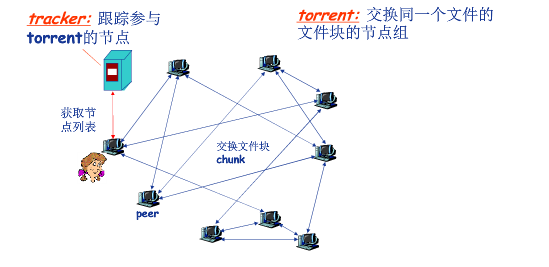

[TOC]

# P2P应用：原理与文件分发

## 纯P2P架构

Peer-to-peer
没有服务器
任意端系统之间直接通信
节点阶段性接入Internet
节点可能更换IP地址

## 文件分发：客户机/服务器 vs. P2P

问题 : 从一个服务器向N个节点分发一个文件需要多长时间?

==**以下速度计算全部是建立在假设：因特网核心速度无限制;服务器客户端带宽全部被运用到文件传输。**而且全部是一个下限！==

us: 服务器上传带宽（upload）
ui: 节点i的上传带宽
di: 节点i的下载带宽

### CS

服务器串行地发送N个副本
 时间： NF/us
客户机i需要F/di时间下载

==**对cs，可以看到时间在N大的时候是和N呈线性的！**==

### 为什么是这样的？不应该传送和发出难道是并行的？？？

### P2P

服务器必须发送一个副本
 时间： F/us
客户机i需要F/di时间下载
总共需要下载NF比特
最快的可能上传速率：us + ui

**==这解释了p2p的自拓展性：对等方除了是bit的消费者还是重新分发者。==**

## P2P文件分发典型例子：BitTorrent（bit激流）

tracker: 跟踪参与torrent的节点，每个torrent都有一个tracker

torrent: 交换同一个文件的文件块的节点组

- 文件划分为256KB的chunk（块）
- 节点加入torrent
  -  没有chunk，但是会逐渐积累
  -  向tracker注册以获得节点清单，与某些节点（“邻居”）建立连接
- 下载的同时，节点需要向其他节点上传chunk（从网络下载的或者是节点自身有的）
-  节点自由的加入或离开
- 一旦节点获得完整的文件，它可能（自私地）离开或（无私地）留下

-  获取chunk
  -  给定任一时刻，不同的节点持有文件的不同chunk集合
  -  节点(Alice)定期查询每个邻居所持有的chunk列表
  -  请求原则（请求获取缺失的chunk）
    - • 稀缺优先的请求建立原则：先去拿自己没有的chunk中最稀少的
-  发（送原则）
  - tit-for-tat（以牙还牙）
    -  Alice向4个邻居发送chunk：正在向Alice发送Chunk的邻居中速率最快的4个，每10秒重新评估top 4
      - **上传速率高，则能够找到更好的交易伙伴，从而更快地获取文件。**
    -  每30秒随机选择一个其他节点，向其发送chunk，则alice可能成为chunk的top4，从而建立新的连接。

## 思考题

BitTorrent技术对网络性能有哪些潜在的危害？

这个欠考虑。

> BT三大指控：高温、重复读写、扇区断块。 
>
> Bittorrent下载是宽带时代新兴的P2P交换文件模式，各用户之间共享资源，互相当种子和中继站，俗称BT下载。由于每个用户的下载和上传几乎是同时进行，因此下载的速度非常快。不过，开发BT的人因为缺乏对维护硬盘的考虑，使用了很差的HASH算法,它会将下载的数据直接写进硬盘(不像FlashGet等下载工具可以调整缓存，到指定的数据量后才写入硬盘)，因此造成硬盘损害，提早结束硬盘的寿命。 
>
> 此外，BT下载事先要申请硬盘空间，在下载较大的文件的时候，一般会有2~3分钟时间整个系统优先权全部被申请空间的任务占用，其他任务反应极慢。有些人为了充分利用带宽，还会同时进行几个BT下载任务，此时就非常容易出现由于磁盘占用率过高而导致的死机故障。 
>
> 因为BT对硬盘的重复读写动作会产生高温，令硬盘的温度升高，直接影响硬盘的寿命。而当下载人数愈多，同一时间读取你的硬盘的人亦愈多，硬盘大量进行重复读写的动作，加速消耗。基于对硬盘工作原理的分析可以知道，硬盘的磁头寿命是有限的，频繁的读写会加快磁头臂及磁头电机的磨损，频繁的读写磁盘某个区域更会使该区温度升高，将影响该区磁介质的稳定性还会导至读写错误，高温还会使该区因热膨涨而使磁头和碟面更近了（正常情况下磁头和碟面只有几个微米，高温膨胀会让磁头更靠近碟面），而且也会影响薄膜式磁头的数据读取灵敏度，会使晶体振荡器的时钟主频发生改变，还会造成硬盘电路元件失灵。任务繁多也会导至ide硬盘过早损坏，由于ide硬盘自身的不足，过多任务请求是会使寻道失败率上升导至磁头频繁复位（复位就是磁头回复到 0磁道，以便重新寻道）加速磁头臂及磁头电机磨损。因此有些人形容，BT就像把单边燃烧的柴枝折开两、三段一起燃烧，大量的读写动作会大大加速硬盘的消耗，燃烧硬盘的生命。 
>
> 其次，同时因为下载太多东西，使扇区的编排混乱，读写数据时要在不同扇区中读取，增加读写次数，加速硬盘消耗。 
> 2、对网络带宽的损害 
>
> 当前，以BitTorrent(以下简称BT)为代表的P2P下载软件流量占用了宽带接入的大量带宽，据统计已经超过了50%。这对于以太网接入等共享带宽的宽带接入方式提出了很大的挑战，大量的使接入层交换机的端口长期工作在线速状态，严重影响了用户使用正常的Web、E-mail以及视频点播等业务，并可能造成重要数据无法及时传输而给企业带来损失。因此，运营商、企业用户以及教育等行业的用户都有对这类流量进行限制的要求。BT将会占用太多的网络资源，从而有可能在接入网、传输网、骨干网等不同层面形成瓶颈，造成资源紧张，这似乎也是目前运营商包括网通、长宽等封掉BT端口的最大理由。 
>
> 3、助长了病毒的传播 
>
> 2005年11月17日，公安部公共信息网络安全监察处许剑卓处长在天津AVAR2005大会上做了《中国网络犯罪现状》的报告，报告指出，通过计算机病毒和木马进行的黑客行为是计算机网络犯罪的主要根源。调查情况表明，计算机病毒除了通过常规的电子邮件等途径传播外，目前网络上盛行的P2P软件成为计算机病毒和木马传播的主要途径。这些病毒和木马对企业的安全形成巨大的挑战。 
> 4、可能面临着版权侵害的风险 
>
> Fred Lawrence是一个美国普通老人，今年67岁，因为自己孙子的缘故惹来了美国电影协会（MPAA）的大麻烦。Lawrence的孙子通过iMesh P2P服务在家中的电脑下载并分享了4部电影，美国电影协会通过IP地址找到了他和他的电脑，并以侵犯版权为由要求老人为此在18个月中付出4000美元的罚金……； 
> 现在国内外都在严厉打击盗版，不排除版权作者或机构通过各种网络跟踪技术来找到非法进行P2P下载的用户，并提起诉讼或者其他赔偿要求；如果企业员工进行了这些行为，可能由此对企业的形象造成极大负面影响，并可能使得企业遭受其他损失。此外，员工可能通过BT等下载一些色情、反动、暴力的等违法的信息，这些信息可能被公安机关检测到，由此可能给员工和企业带来法律风险。 

# P2P应用：索引技术

## P2P: 搜索信息

- P2P系统的索引：信息到节点位置(IP地址+端口号)的映射
- 文件共享(电驴)
  -  利用索引**动态跟踪、存储**节点所共享的文件的位置
  -  节点需要告诉索引它拥有哪些文件
  -  节点搜索索引，从而获知能够得到哪些文件
- 即时消息(QQ)
  -  索引负责将用户名映射到位置
  -  当用户开启IM应用时，需要通知索引它的位置
  -  节点检索索引，确定用户的IP地址

## 集中式索引

- Napster最早采用这种设计
  -  1) 节点加入时，通知中央服务器：
    - • IP地址
    - • 内容
  -  2) Alice查找“Hey Jude”
  -  3) Alice从Bob处请求文件

- 集中式索引的问题
  - 单点失效问题
  - 性能瓶颈
  - 版权问题（集中目录容易被发现版权问题）

## 全分布非结构：洪泛式查询（Query flooding）

- 完全分布式架构
- 每个节点对它共享的文件进行索引，且只对它共享的文件进行索引

### 如何查询？

由覆盖网络(overlay network): Graph来组织查询和连接

- 节点X与Y之间如果有TCP连接，那么构成一个边
- 所有的活动节点和边构成覆盖网络
  - 边：虚拟链路
- 节==点一般邻居数少于10个？？？==

在覆盖网络上进行广播来完成查询。

- 查询消息通过已有的TCP连接发送
- 节点转发查询消息
- 如果查询命中，则利用反向路径发回查询节点

- 问题
  - 信息泛滥，带宽压力，无效的垃圾信息
  - 网络形成之初，难以形成网络，而成为各个独立分支，造成信息缺失。需要特殊手段处理

## 层次式覆盖网络

- 介于集中式索引和洪泛查询之间的方法
- 每个节点或者是一个超级节点，或者被分配一个超级节点
  -  节点和超级节点间维持TCP连接（集中式索引）
  -  某些超级节点对之间维持TCP连接（超级节点之间是洪泛式）
- 超级节点负责跟踪子节点的内容

## P2P案例应用：Skype（最成功的之一）

通话时是P2P的：==用户/节点对之间直接通信。但是索引阶段是层次式覆盖网络架构==

私有应用层协议

**采用层次式覆盖网络架构**

**索引负责维护用户名与IP地址间的映射**

**索引分布在超级节点上**

## 课后作业

查阅Skype应用的相关资料，就其架构、协议、算法等撰写一篇调研报告，长度在5000字以上。