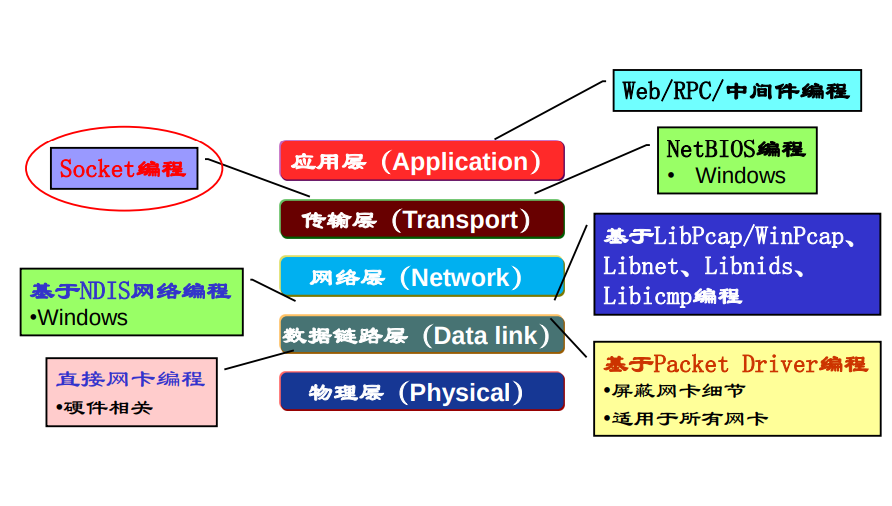
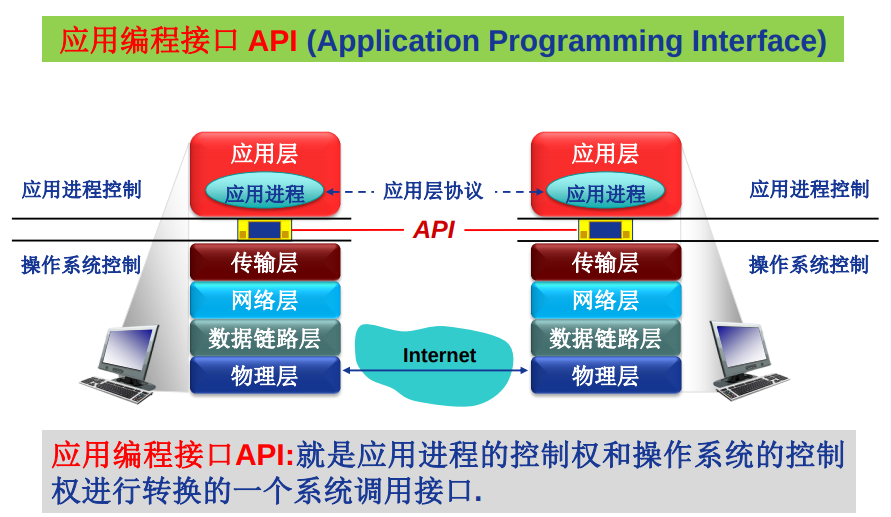
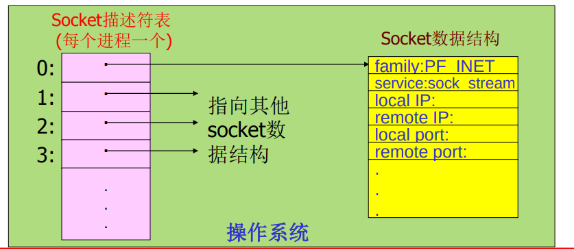
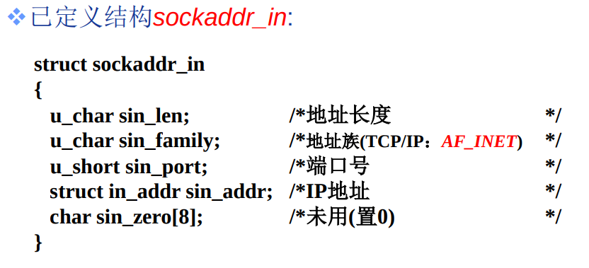

# Socket编程API

## 网络程序设计接口主要类型

开发网络应用程序关联的API类型。

- 直接面向网卡编程-大部分不需要也难以掌握。
- 网卡之上的，数据链路层的编程，屏蔽网卡细节，适用所有网卡。
- 特定操作系统的开发api。
- 基于库的。
- socket：应用层、传输层之间的。

## 理解应用编程接口API

- 应用层协议组构应用进程之间的逻辑连接。
- API通常是从传输层开始封装。

## 几种典型的应用编程接口

- Berkeley UNIX 操作系统定义了一种 API，称为**套接字接口(**socket interface)，简称套接字（socket）。
- 微软公司在其操作系统中采用了套接字接口 API，形成了一个稍有不同的 API，并称之为Windows Socket Interface，**WINSOCK**。
- AT&T （美国电话电报公司）为其 UNIX 系统 V 定义了一种 API，简写为 **TLI** (Transport Layer Interface)。
  - **UNIX**，一种计算机[操作系统](https://zh.wikipedia.org/wiki/%E6%93%8D%E4%BD%9C%E7%B3%BB%E7%BB%9F)，具有多任务、多用户的特征。于1969年，在美国[AT&T](https://zh.wikipedia.org/wiki/AT%26T)公司的[贝尔实验室](https://zh.wikipedia.org/wiki/%E8%B4%9D%E5%B0%94%E5%AE%9E%E9%AA%8C%E5%AE%A4)开发[类UNIX](https://zh.wikipedia.org/wiki/%E9%A1%9EUNIX)（UNIX-like）

# Socket编程-Socket API概述

## Socket API

抽象通信机制。是一种门面模式，为应用层封装传输层协议，为应用层提供抽象链路。

- 最初设计
  - 面向BSD UNIX-Berkley
  - 面向TCP/IP协议栈接口
- 目前
  - Internet网络应用最典型的API接口，事实上的工业标准
  - 绝大多数操作系统都支持
- 通信模型
  - 客户/服务器（C/S）
- ==**由进程或者操作系统创建**==
  - 本质上是操作系统提供api，进程调用该api通知操作系统创建。

### 如何标识socket？

- 对外
  - 标识通信端点：
    - IP地址+端口号（**16位整数端口号**）
- **对内**
  - **操作系统/进程**如何管理套接字（对内）？
    - 套接字描述符（socket descriptor）
      - **==小整数==**
      - 当应用程序要创建一个套接字时，操作系统就返回一个小整数作为描述符，应用程序则使用这个描述符来引用该套接字。

## 对内的Socket抽象

- 类似于文件的抽象，像文件一样管理socket
- 当应用进程创建套接字时，**操作系统**分配一个**数据结构存储该套接字相关信息**
- 进程调用api通知操作系统创建套接字，该函数由操作系统返回套接字描述符给进程。
- 都是通过该socket描述符来引用、访问套接字。
- 每一个进程都管理一个soket描述符表，管理其创建的socket，这个表类似一个结构体指针数组，每个指针指向一个socket数据结构。

## socket地址结构

- IP地址、本地端口号这两个必需。
- socket提供多协议支持，不仅仅是TCP/IP
  - 地址族：表述所使用的传输层协议
  - AF_INEF：TCP/IP使用的地址族
    - 只需知道，windows下tcpip要用的地址族是AF_INEF就够了
  - sin_zero是为了让sockaddr与sockaddr_in两个数据结构保持大小相同而保留的空字节。
- 使用TCP/IP协议簇的网络应用程序声明端点地址变量时，使用结构sockaddr_in

> sockaddr与sockaddr_in：
>
> 注释中标明了属性的含义及其字节大小，这两个结构体一样大，都是16个字节，而且都有family属性，不同的是：
>
> sockaddr用其余14个字节来表示sa_data，而sockaddr_in把14个字节拆分成sin_port, sin_addr和sin_zero
>
> 分别表示端口、ip地址。sin_zero用来填充字节使sockaddr_in和sockaddr保持一样大小。
>
> sockaddr和sockaddr_in包含的数据都是一样的，但他们在使用上有区别：
>
> 程序员不应操作sockaddr，sockaddr是给操作系统用的
>
> 程序员应使用sockaddr_in来表示地址，sockaddr_in区分了地址和端口，使用更方便。