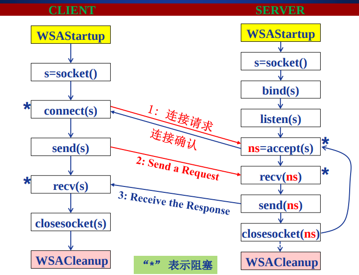

[TOC]


# Socket编程API

## 网络程序设计接口主要类型

开发网络应用程序关联的API类型。

- 直接面向网卡编程-大部分不需要也难以掌握。
- 网卡之上的，数据链路层的编程，屏蔽网卡细节，适用所有网卡。
- 特定操作系统的开发api。
- 基于库的。
- socket：应用层、传输层之间的。


## 理解应用编程接口API


- 应用层协议组构应用进程之间的逻辑连接。
- API通常是从传输层开始封装。

## 几种典型的应用编程接口

- Berkeley UNIX 操作系统定义了一种 API，称为**套接字接口(**socket interface)，简称套接字（socket）。
- 微软公司在其操作系统中采用了套接字接口 API，形成了一个稍有不同的 API，并称之为Windows Socket Interface，**WINSOCK**。
- AT&T （美国电话电报公司）为其 UNIX 系统 V 定义了一种 API，简写为 **TLI** (Transport Layer Interface)。
  - **UNIX**，一种计算机[操作系统](https://zh.wikipedia.org/wiki/%E6%93%8D%E4%BD%9C%E7%B3%BB%E7%BB%9F)，具有多任务、多用户的特征。于1969年，在美国[AT&T](https://zh.wikipedia.org/wiki/AT%26T)公司的[贝尔实验室](https://zh.wikipedia.org/wiki/%E8%B4%9D%E5%B0%94%E5%AE%9E%E9%AA%8C%E5%AE%A4)开发[类UNIX](https://zh.wikipedia.org/wiki/%E9%A1%9EUNIX)（UNIX-like）


# Socket编程-Socket API概述

## Socket API

抽象通信机制。是一种门面模式，为应用层封装传输层协议，为应用层提供抽象链路。

- 最初设计
  - 面向BSD UNIX-Berkley
  - 面向TCP/IP协议栈接口
- 目前
  - Internet网络应用最典型的API接口，事实上的工业标准
  - 绝大多数操作系统都支持
- 通信模型
  - 客户/服务器（C/S）
- ==**由进程或者操作系统创建**==
  - 本质上是操作系统提供api，进程调用该api通知操作系统创建。

### 如何标识socket？

- 对外
  - 标识通信端点：
    - IP地址+端口号（**16位整数端口号**）
- **对内**
  - **操作系统/进程**如何管理套接字（对内）？
    - 套接字描述符（socket descriptor）
      - **==小整数==**
      - 当应用程序要创建一个套接字时，操作系统就返回一个小整数作为描述符，应用程序则使用这个描述符来引用该套接字。


## 对内的Socket抽象

- 类似于文件的抽象，像文件一样管理socket
- 当应用进程创建套接字时，**操作系统**分配一个**数据结构存储该套接字相关信息**
- 进程调用api通知操作系统创建套接字，该函数由操作系统返回套接字描述符给进程。
- 都是通过该socket描述符来引用、访问套接字。
- 每一个进程都管理一个soket描述符表，管理其创建的socket，这个表类似一个结构体指针数组，每个指针指向一个socket数据结构。


## socket地址结构


- IP地址、本地端口号这两个必需。
- socket提供多协议支持，不仅仅是TCP/IP
  - 地址族：表述所使用的传输层协议
  - AF_INEF：TCP/IP使用的地址族
    - 只需知道，windows下tcpip要用的地址族是AF_INEF就够了
  - sin_zero是为了让sockaddr与sockaddr_in两个数据结构保持大小相同而保留的空字节。
- 使用TCP/IP协议簇的网络应用程序声明端点地址变量时，使用结构sockaddr_in

> sockaddr与sockaddr_in：
>
> 注释中标明了属性的含义及其字节大小，这两个结构体一样大，都是16个字节，而且都有family属性，不同的是：
>
> sockaddr用其余14个字节来表示sa_data，而sockaddr_in把14个字节拆分成sin_port, sin_addr和sin_zero
>
> 分别表示端口、ip地址。sin_zero用来填充字节使sockaddr_in和sockaddr保持一样大小。
>
> sockaddr和sockaddr_in包含的数据都是一样的，但他们在使用上有区别：
>
> 程序员不应操作sockaddr，sockaddr是给操作系统用的
>
> 程序员应使用sockaddr_in来表示地址，sockaddr_in区分了地址和端口，使用更方便。


# Socket编程-Socket API函数

## Socket API函数（以WinSock为例）

winsock实现机制是动态连接库，所以要初始化、释放动态连接库，使用api开始和结束要分别调用

- WSAStartup（初始化Windows Sockets API）
- WSACleanup（释放所使用的WindowsSockets DLL）

### WSAStartup

使用Socket的应用程序在使用Socket之前**必须首先**调用WSAStartup函数

```
int WSAStartup(WORD wVersionRequested, LPWSADATA lpWSAData);
```

- WORD       wVersionRequested
  - 指明程序请求使用的WinSock版本，其中高位字节指明副版本、低位字节指明主版本
  - 十六进制整数，例如0x102表示2.1版
- LPWSADATA       lpWSAData
  - 返回实际的WinSock的版本信息，指向WSADATA结构的指针
- 例：使用2.1版本的WinSock的程序代码段

```java
int WSAStartup(WORD wVersionRequested, LPWSADATA lpWSAData);
wVersionRequested = MAKEWORD( 2, 1 );
err = WSAStartup( wVersionRequested, &wsaData ); 
```

### WSACleanup

应用程序在完成对请求的Socket库的使用，最后要调用WSACleanup函数。

```c
int WSACleanup (void); 
```

- 解除与Socket动态库的绑定。
- 释放Socket库所占用的系统资源。

下面的不带wsa的api是多系统通用的，上面的wsa api是win专用的

### socket

创建套接字

```java
sd = socket(protofamily,type,proto);
```

- sd

  - 操作系统返回的套接字描述符，应用层使用该描述符操作、引用套接字。

- protofamily协议族（说明面向哪个协议族）

  - protofamily = PF_INET（TCP/IP）

- ==type套接字类型==（每种协议族不同，下面的例子是）

  -  type = SOCK_STREAM,SOCK_DGRAM or SOCK_RAW（TCP/IP）

- proto(协议号，访问的是哪种协议):0表示缺省，可以使用对应数字表示所选协议族和套接字类型的支持的协议号

- 例：创建一个流套接字的代码段

  ```c
  struct protoent *p;
  p=getprotobyname("tcp");
  SOCKET sd=socket(PF_INET,SOCK_STREAM,p->p_proto); 
  ```

### Socket面向TCP/IP的服务类型


stream（传输流，使用tcp）：可靠、面向连接、字节流传输、点对点（一个连接只能连接两点）

dgram（datagram数据报，使用udp）：不可靠、五连接、数据报传输

raw（raw：生的，这里指不加传输层处理的原始套接字）closesocket（linux版为close）

关闭一个描述符为sd的套接字。

```c
int closesocket(SOCKET sd); 
```

- 如果多个**进**程共享一个套接字，有计数。
  - 调用closesocket将把调用进程的描述符表中的引用删除，然后该socket的数据结构的reference counting减1，减至0才释放该socket数据结构空间。

- 一个进程中的多**线**程对一个套接字的使用无计数
  - 如果进程中的一个线程调用closesocket将一个套接字关闭，则该进程的描述符表中无该socket数据结构的引用，该进程中的其他线程也将不能访问该套接字。
  - ==**描述符表是一个进程一个，而不是一个线程一个！**==

- 返回值
  - 0：成功
  - SOCKET_ERROR：失败

### bind

绑定（填写）套接字的本地端点地址（IP地址+==16进制==端口号）

```c
int bind(sd,localaddr,addrlen);
```

- 参数:
  - 套接字描述符（sd）
  - 端点地址（localaddr）
    - 结构sockaddr_in
- 客户程序一般不必调用bind函数，因为这个工作一般是由操作系统来完成的。
- 服务器端需要调用
  - 绑定设置熟知端口号：80 25 等等
  - IP地址？服务器运行主机的ip地址可以吗？
  - 绑定问题：服务器应该绑定哪个地址？
  - 解决方案
    - 地址通配符：INADDR_ANY，把ip地址附成该值，表示主机上任意一个有效ip地址都是可以来访问该socket。
    - 服务器应该绑定INADDR_ANY：端口号，而是不具体IP：端口号


### listen

置流套接字处于监听状态，listen只用于服务器端，仅面向tcp连接的流类型。

```
int listen(sd,queuesize);
```

- 设置连接请求缓存队列大小（queuesize）
- 返回值：
  - 0：成功
  - SOCKET_ERROR：失败

### connect

```
connect(sd,saddr,saddrlen);
```

- 客户程序调用connect函数来使本地套接字（sd）与特定计算机的特定端口（saddr）的套接字（服务）进行连接
- 仅用于客户端
- 可用于TCP客户端也可以用于UDP客户端
  - 用于TCP客户端：建立TCP连接
  - 用于UDP客户端：只是简单的本地指定了服务器端点地址，在之后发送数据报和接受数据时使用该地址。

### accept

```c
newsock = accept(sd,caddr,caddrlen);
```

- 服务程序调用accept函数从处于监听状态的流套接字sd的客户连接请求队列中取出排在**最前的一个**客户请求，并且**创建一个新的套接字**来与客户套接字创建连接通道。
- 注意这里接受的是建立连接的请求，而不是对数据的请求，后者由recv, recvfrom负责，数据由send, sendto发送。
- 仅用于TCP套接字
- 仅用于服务器
- 利用新创建的套接字
- 使用新套接字（newsock）与客户通信，why？
  - tcp是点对点的，socket2socket的，单对单的，如果不这么做，就不能并发的提供服务。这里把接受服务和提供服务的socket区分开了。

### send, sendto（服务器客户机都用）

```python
send(sd,*buf,len,flags);
sendto(sd,*buf,len,flags,destaddr,addrlen);
```

- send函数TCP套接字（客户与服务器）或调用了connect函数的UDP客户端套接字
- sendto函数用于UDP服务器端套接字与未调用connect函数的UDP客户端套接字

### recv, recvfrom（服务器客户机都用）

```python
recv(sd,*buffer,len,flags);
recvfrom(sd,*buf,len,flags,senderaddr,saddrlen);
```

- recv函数从TCP连接的另一端接收数据，或者从调用了connect函数的UDP客户端套接字接收服务器发来的数据。
- recvfrom函数用于从UDP服务器端套接字与未调用connect函数的UDP客户端套接字接收对端数据。

### setsockopt, getsockopt（不具体讲了）

```
int setsockopt(int sd, int level, int optname, *optval, int optlen);
int getsockopt(int sd, int level, int optname,*optval, socklen_t *optlen);
```

- setsockopt()函数用来设置套接字sd的选项参数
- getsockopt()函数用于获取任意类型、任意状态套接口的选项当前值，并把结果存入optval

## Socket API函数小结

### win独占

-  WSAStartup: 初始化socket库(仅对WinSock)
-  WSACleanup: 清楚/终止socket库的使用 (仅对WinSock)

### 多平台通用

-  socket: 创建套接字
-  connect:“连接”远端服务器 (仅用于客户端)
-  closesocket: 释放/关闭套接字
-  bind: 绑定套接字的本地IP地址和端口号（通常客户端不需要）
-  listen: 置服务器端TCP套接字为监听模式，并设置队列大小 (仅用于服务器端TCP套接字)
-  accept: 接受/提取一个连接请求，创建新套接字，通过新套接 (仅用于服务器端的TCP套接字)
-  recv: 接收数据（用于TCP套接字或连接模式的客户端UDP套接字）
-  recvfrom: 接收数据报（用于非连接模式的UDP套接字）
-  send: 发送数据（用于TCP套接字或连接模式的客户端UDP套接字）
-  sendto:发送数据报（用于非连接模式的UDP套接字）
-  setsockopt: 设置套接字选项参数（用的时候查）
-  getsockopt: 获取套接字选项参数（用的时候查）

## 关于网络字节顺序

osi7层模型才有表示层来兼容字节顺序，5层中是没有的，需要协议辅助完成该功能。

- TCP/IP定义了标准的用于协议头中的二进制整数表示：网络字节顺序（network byte order）
- 某些Socket API函数的参数需要存储为网络字节顺序而不是本地字节顺序（如IP地址、端口号等）。
- 可以实现本地字节顺序与网络字节顺序间转换的函数
  -  htons: 本地字节顺序→网络字节顺序(16bits)（host2net s）
  -  ntohs: 网络字节顺序→本地字节顺序(16bits)
  -  htonl: 本地字节顺序→网络字节顺序(32bits)
  -  ntohl: 网络字节顺序→本地字节顺序(32bits)

## 网络应用的Socket API(TCP)调用基本流程



阻塞过程，表示当函数未成功则一直等待。

左右两边都有2个阻塞函数。

ns：newsocket

注意两边close的区别，服务器只是关闭了ns。


# Socket编程-客户端软件设计

## 解析服务器IP地址

-  客户端可能使用域名（如:study.163.com）或IP地址（如：123.58.180.121）标识服务器
-  IP协议需要使用32位二进制IP地址
-  需要将域名或IP地址转换为32位IP地址
  -  函数inet_addr( ) 实现点分十进制IP地址到32位IP地址转换
  -  函数gethostbyname( ) 实现域名到32位IP地址转换
    - • 返回一个指向结构hostent 的指针
    - 已经是网络字节顺序

## 解析服务器（熟知）端口号

 客户端还可能使用服务名（如HTTP）标识服务器端口
 需要将服务名转换为熟知端口号
 函数getservbyname( )
• 返回一个指向结构servent的指针

## 解析协议号

 客户端可能使用协议名（如:TCP）指定协议
 需要将协议名转换为协议号（如：6）
 函数getprotobyname ( ) 实现协议名到协议号的转换
• 返回一个指向结构protoent的指针

## TCP客户端软件流程

1. 确定服务器IP地址与端口号
2. 创建套接字
3. 分配本地端点地址（IP地址+端口号）
4. 连接服务器（套接字）
5. 遵循应用层协议进行通信
6. 关闭/释放连接

## UDP客户端软件流程

1. 确定服务器IP地址与端口号
2. 创建套接字
3. 分配本地端点地址（IP地址+端口号）
4. 指定服务器端点地址，构造UDP数据报
5. 遵循应用层协议进行通信
6. 关闭/释放套接字

## 客户端软件的实现- connectsock()

设计一个connectsock过程封装底层代码

```java
/* consock.cpp - connectsock */
#include <stdlib.h>
#include <stdio.h>
#include <string.h>
#include <winsock.h>
#ifndef INADDR_NONE
#define INADDR_NONE 0xffffffff
#endif /* INADDR_NONE */
void errexit(const char *, ...);
/*-------------------------------------------------------
* connectsock - allocate & connect a socket using TCP or UDP
*------------------------------------------------------
*/


SOCKET connectsock(const char *host, const char *service, const char
*transport )
{
struct hostent *phe; /* pointer to host information entry */
struct servent *pse; /* pointer to service information entry */
struct protoent *ppe; /* pointer to protocol information entry */
struct sockaddr_in sin;/* an Internet endpoint address */
int s, type; /* socket descriptor and socket type */
memset(&sin, 0, sizeof(sin));
sin.sin_family = AF_INET; 


/* Map service name to port number */
if ( pse = getservbyname(service, transport) )
sin.sin_port = pse->s_port;
else if ( (sin.sin_port = htons((u_short)atoi(service))) == 0 )
errexit("can't get \"%s\" service entry\n", service);
 /* Map host name to IP address, allowing for dotted decimal */
if ( phe = gethostbyname(host) )
memcpy(&sin.sin_addr, phe->h_addr, phe->h_length);
else if ( (sin.sin_addr.s_addr = inet_addr(host))==INADDR_NONE)
errexit("can't get \"%s\" host entry\n", host);
 /* Map protocol name to protocol number */
if ( (ppe = getprotobyname(transport)) == 0)
errexit("can't get \"%s\" protocol entry\n", transport); 


/* Use protocol to choose a socket type */
if (strcmp(transport, "udp") == 0)
type = SOCK_DGRAM;
else
type = SOCK_STREAM;
 /* Allocate a socket */
s = socket(PF_INET, type, ppe->p_proto);
if (s == INVALID_SOCKET)
errexit("can't create socket: %d\n", GetLastError());
 /* Connect the socket */
if (connect(s, (struct sockaddr *)&sin, sizeof(sin))==SOCKET_ERROR)
errexit("can't connect to %s.%s: %d\n", host, service,
GetLastError());
return s;
}
```

## 客户端软件的实现-UDP客户端

设计connectUDP过程用于创建连接模式客户端UDP套接字

```
/* conUDP.cpp - connectUDP */
#include <winsock.h>
SOCKET connectsock(const char *, const char *, const char *);
/*-------------------------------------------------------
 * connectUDP - connect to a specified UDP service
 * on a specified host
 *-----------------------------------------------------
*/
SOCKET connectUDP(const char *host, const char *service )
{
return connectsock(host, service, "udp");
}
```

## 客户端软件的实现-TCP客户端

设计connectTCP过程，用于创建客户端TCP套接字

```c
/* conTCP.cpp - connectTCP */
#include <winsock.h>
SOCKET connectsock(const char *, const char *, const char *);
/*----------------------------------------------------
 * connectTCP - connect to a specified TCP service
 * on a specified host
 *---------------------------------------------------
 */
SOCKET connectTCP(const char *host, const char *service )
{
return connectsock( host, service, "tcp");
}
```

## 客户端软件的实现-异常处理

```c
/* errexit.cpp - errexit */
#include <stdarg.h>
#include <stdio.h>
#include <stdlib.h>
#include <winsock.h>
/*----------------------------------------------------------
* errexit - print an error message and exit
*----------------------------------------------------------
*/
/*VARARGS1*/
void errexit(const char *format, ...)
{ va_list args;
va_start(args, format);
vfprintf(stderr, format, args);
va_end(args);
WSACleanup();
exit(1);}
```

## 例1：访问DAYTIME服务的客户端（TCP）

DAYTIME服务
 获取日期和时间
 双协议服务（TCP、 UDP），端口号13
 TCP版利用TCP连接请求触发服务
 UDP版需要客户端发送一个请求

```c
/* TCPdtc.cpp - main, TCPdaytime */
#include <stdlib.h>
#include <stdio.h>
#include <winsock.h>
void TCPdaytime(const char *, const char *);
void errexit(const char *, ...);
SOCKET connectTCP(const char *, const char *);
#define LINELEN 128
#define WSVERS MAKEWORD(2, 0)
/*--------------------------------------------------------
* main - TCP client for DAYTIME service
*--------------------------------------------------------
*/
int main(int argc, char *argv[])
{
char *host = "localhost"; /* host to use if none supplied */
char *service = "daytime"; /* default service port */
WSADATA wsadata;
switch (argc) {
case 1:
host = "localhost";
break;
case 3:
service = argv[2];
/* FALL THROUGH */
case 2:
host = argv[1];
break;
default:
fprintf(stderr, "usage: TCPdaytime [host [port]]\n");
exit(1);
}
if (WSAStartup(WSVERS, &wsadata) != 0)
errexit("WSAStartup failed\n");
TCPdaytime(host, service);
WSACleanup();
return 0; /* exit */
}
/*-----------------------------------------------------
* TCPdaytime - invoke Daytime on specified host and print results
*-----------------------------------------------------
*/
void TCPdaytime(const char *host, const char *service)
{
char buf[LINELEN+1]; /* buffer for one line of text */
SOCKET s; /* socket descriptor */
int cc; /* recv character count */
 s = connectTCP(host, service);
cc = recv(s, buf, LINELEN, 0);
while( cc != SOCKET_ERROR && cc > 0)
{
buf[cc] = '\0'; /* ensure null-termination */
(void) fputs(buf, stdout);
cc = recv(s, buf, LINELEN, 0);
}
closesocket(s);
}
```

## 例2：访问DAYTIME服务的客户端（UDP）

```
/* UDPdtc.cpp - main, UDPdaytime */
#include <stdlib.h>
#include <stdio.h>
#include <winsock.h>
void UDPdaytime(const char *, const char *);
void errexit(const char *, ...);
SOCKET connectUDP(const char *, const char *);
#define LINELEN 128
#define WSVERS MAKEWORD(2, 0)
#define MSG “what daytime is it?\n"
/*--------------------------------------------------------
* main - UDP client for DAYTIME service
*--------------------------------------------------------
*/
int main(int argc, char *argv[])
{
char *host = "localhost"; /* host to use if none supplied */
char *service = "daytime"; /* default service port */
WSADATA wsadata;
switch (argc) {
case 1:
host = "localhost";
break;
case 3:
service = argv[2];
/* FALL THROUGH */
case 2:
host = argv[1];
break;
default:
fprintf(stderr, "usage: UDPdaytime [host [port]]\n");
exit(1);
}
if (WSAStartup(WSVERS, &wsadata) != 0)
errexit("WSAStartup failed\n");
UDPdaytime(host, service);
WSACleanup();
return 0; /* exit */
}
/*-----------------------------------------------------
* UDPdaytime - invoke Daytime on specified host and print results
*-----------------------------------------------------
*/
void UDPdaytime(const char *host, const char *service)
{
char buf[LINELEN+1]; /* buffer for one line of text */
SOCKET s; /* socket descriptor */
int n; /* recv character count */
s = connectUDP(host, service);
(void) send(s, MSG, strlen(MSG), 0);
/* Read the daytime */
n = recv(s, buf, LINELEN, 0);
if (n == SOCKET_ERROR)
errexit("recv failed: recv() error %d\n", GetLastError());
else
{
buf[cc] = '\0'; /* ensure null-termination */
(void) fputs(buf, stdout);
}
closesocket(s);
return 0; /* exit */
}
```

