[TOC]


# 学习目标

- 理解传输层服务的基本理论和基本机制

  - 复用/分用
  - 可靠数据传输机制
  - 流量控制机制
  - 拥塞控制机制

- 掌握Internet的传输层协议

  - UDP：无连接传输服务
  - TCP：面向连接的传输服务
  - TCP拥塞控制

  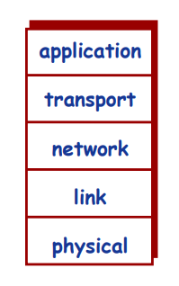


# 传输层服务概述

## 传输层服务和协议

- 传输层协议为运行在不同Host上的进程提供了一种**逻辑通信机制**，两个进程之间仿佛是直接连接的，也是一种**端到端的连接**
- 端系统按照传输层协议使用传输层功能
  - 发送方传输层：将应用递交的消息分成一个或多个的Segment，并向下传给网络层。
  - 接收方传输层：将接收到的segment组装成消息，并向上交给应用层。
- 传输层可以为应用提供多种协议
  - Internet上的TCP
  - Internet上的UDP

## 传输层 vs. 网络层

- 区分
  - 网络层：提供主机（IP地址）之间的逻辑通信机制
  - 传输层：提供应用进程（IP：port）之间的逻辑通信机制，相对于网络层，传输层的目标是更明确的，是更细分的。
- 联系
  - 传输层位于网络层之上
  - 传输层依赖于网络层服务
  - 传输层对网络层服务进行（可能的）增强

## Internet传输层协议

- 可靠、按序的交付服务(TCP)
  - 拥塞控制
  - 流量控制
  - 连接建立
- 不可靠的交付服务(UDP)
  - 基于“尽力而为(Best-effort)”的网络层，尽力做到最好，但是没有保证可靠性
- 两种服务均不保证
  - 延迟
  - 带宽


# 多路复用和多路分用

## 多路复用/分用

==多路复用和多路分用的区别？==

多路分用：接受

多路复用：发送

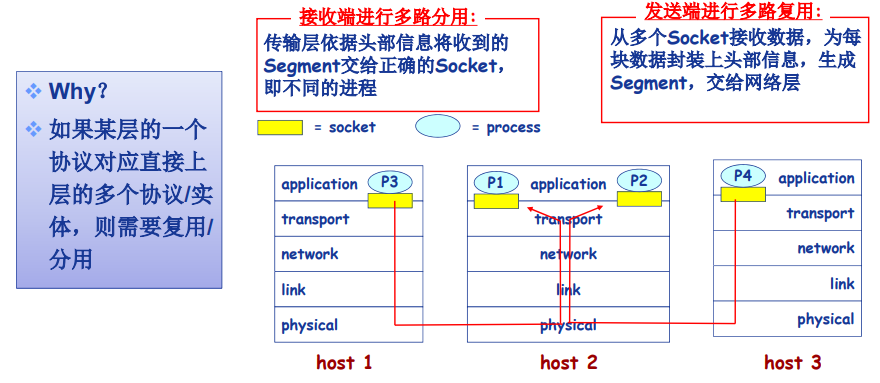

## 分用如何工作？

-  主机接收到IP数据报(datagram)（**==报文段**）
     -   每个数据报携带源IP地址、目的IP地址。
     -  每个数据报携带一个传输层的段(Segment）。
     -  每个段携带源端口号和目的端口号
-  主机收到Segment之后，传输层协议提取IP地址和端口号信息，将Segment导向相应的Socket
     -  TCP做更多处理
-  网络层不关心端口号


## 无连接分用（UDP）

-  利用端口号创建Socket

```java
DatagramSocket mySocket1 = new DatagramSocket(99111);
DatagramSocket mySocket2 = new DatagramSocket(99222);
```

-  UDP的报文段中的目的Socket用**二元组**标识
     -   (目的IP地址，目的端口号)
-  主机收到UDP段后
     -  检查**==段中的目的端口号==**
     -  将UDP段导向绑定在该端口号的Socket
-  来自不同源IP地址和/或源端口号的IP数据包被导向同一个Socket
-  SP：源
-  DP：目的

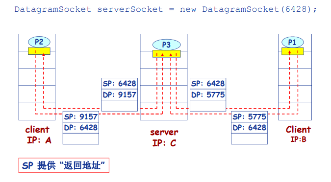

## 面向连接的分用

-  TCP的Socket用四元组标识
     -   源IP地址
     -  源端口号
     -  目的IP地址
     -  目的端口号
-  接收端利用所有的四个值将Segment导向合适的Socket
-  服务器可能同时支持多个TCPSocket
     -  每个Socket用自己的四元组标识
-  Web服务器为每个客户端开不同的Socket


### 面向连接的分用：多线程Web服务器

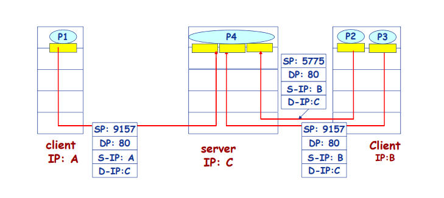

一个进程创建多个线程，可以重复利用进程，不再是单tcp两边必须是独占进程。

但是注意，多个tcp连接到某个进程的多个线程，其目的ip、port是相同的。


# UDP

## UDP: User Datagram Protocol [RFC 768]

**功能**

-   基于Internet IP协议

      -   复用/分用
      -   简单的错误校验

-   “Best effort”服务，UDP段可能

      -   丢失
      -   非按序到达

-   无连接

      -   UDP发送方和接收方之间不需要握手
      -   每个UDP段的处理独立于其他段


### UDP为什么存在?

-   无需建立连接 (减少延迟)
-   实现简单：无需维护连接状态
-   头部开销少
-   没有拥塞控制: 应用可更好地控制发送时间和速率

### 应用场景

-  常用于流媒体应用
     -   容忍丢失
     -  速率敏感
-  UDP还用于
     -  DNS
     -  SNMP
-  在UDP上实现可靠数据传输？
     -  在应用层增加可靠性机制
     -  应用特定的错误恢复机制

### 报文格式

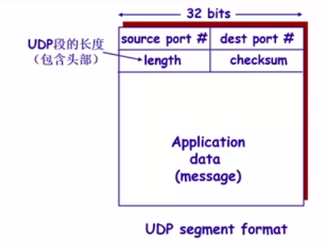

## UDP校验和(checksum)

目的：检测UDP段在传输中是否发生错误（如位翻转）

-  发送方
     -  将段的内容视为16-bit整数
     -  校验和计算：计算所有整数的和，**==进位加在和的后面，将得到的值按位求反==**，得到校验和
     -  发送方将校验和放入校验和字段
-  接收方
     -  计算所收到段的校验和
     -  将其与校验和字段进行对比
          -  不相等：检测出错误
          -  相等：没有检测出错误**（但可能有错误）**


### 校验和计算示例

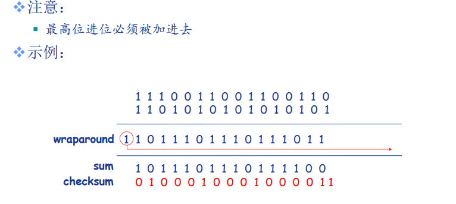

# 可靠数据传输

-  什么是可靠？
     -   准确（没有bit错误）、完整（没有丢包而不知道导致真正丢失）、有序（分组有序）
-  可靠数据传输协议
     -  可靠数据传输对应用层、传输层、链路层都有很高的要求
     -  被列为网络Top-10问题之一
     -  信道的不可靠特性决定了可靠数据传输协议(rdt)的复杂性
     -  使用rdt缩写可靠数据传输协议

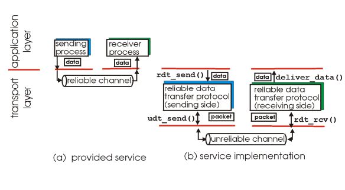

## 可靠数据传输协议基本结构:接口

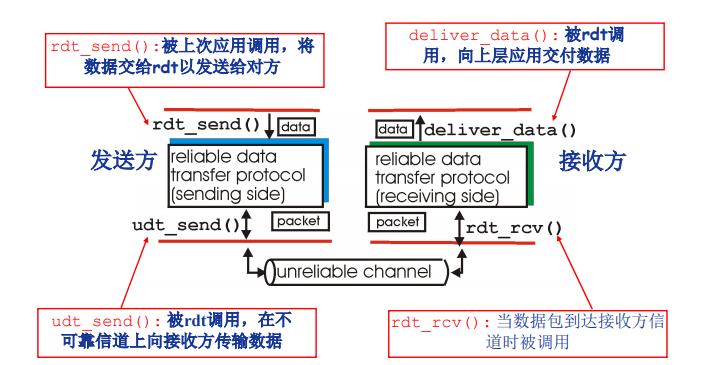

注意观察四个协议箭头的方向。

## 可靠数据传输协议

-  下面的学习过程中我们渐进地设计可靠数据传输协议的发送方和接收方
-  我们建立假设：只考虑单向数据传输。毕竟双向是单向的拟合。
     -   但控制信息双向流动，即控制信息和数据传输不同。我们的控制信息还是双向考察。
-  选择有限状态机(Finite State Machine, FSM)这个工具来刻画rdt

## Rdt 1.0: 可靠信道上的可靠数据传输

我们渐进式考察复杂rdt的第一步，先看看最简单的情况

-  底层信道完全可靠
     - 不会发生错误(bit error)
     -  不会丢弃分组
-  发送方和接收方的FSM（有限状态机）独立


## Rdt 2.0: 仅产生位错误的信道（无丢包和乱序）

-   底层信道可能翻转分组中的位(bit)，需要**==检测错误==**
      -   利用校验和检测位错误
-   如何从错误中**==恢复==**？
      -   **确认机制(Acknowledgements, ACK)**: 接收方显式地告知发送方分组已正	确接收
      -   **NAK**:接收方显式地告知发送方分组有错误（==和ack是不同的机制，两个机制组合起来成为完整ARQ==）
      -   **发送方收到NAK后，重传分组**==
-   基于这种重传机制的rdt协议称为**ARQ(Automatic Repeat reQuest)自动重传请求**协议
-   Rdt 2.0中引入的新机制
      -   差错检测（如校验和）
      -   接收方反馈控制消息: ACK/NAK
      -   重传

### Rdt 2.0: FSM规约

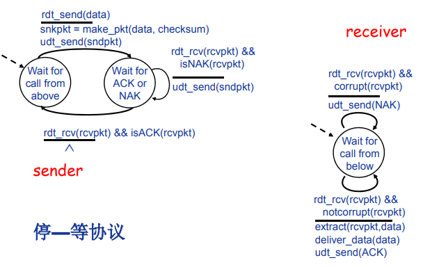

### Rdt 2.0: 无错误场景

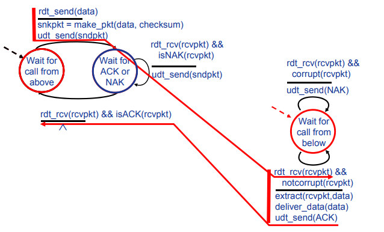

### Rdt 2.0: 有错误场景

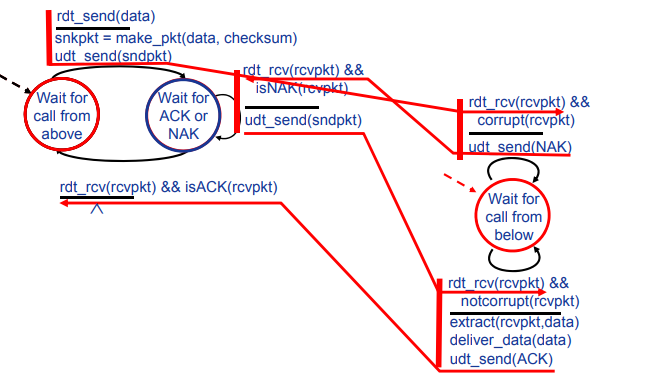

## Rdt 2.1

### Rdt 2.0有什么缺陷？

-   如果**ACK/NAK消息发生错误/被破坏(corrupted)，发送方不知道接收方发生了什么**会怎么样？
      -   方法1：为ACK/NAK增加校验和，检错并回复错误（很难，不能保证100%，或者要额外代价）
      -   方法2：发送方收到被破坏ACK/NAK时不知道接收方发生了什么，回复额外的控制消息。这个仍然不可以，因为控制消息也可能被破坏
      -   方法3：发送方收到坏的ACK/NAK，发送方重传全部数据
        -   **不能简单的重传数据，否则会产生重复分组**
-   如何**解决重复分组**问题？
      -   **序列号**(Sequence number): 发送方给每个分组增加序列号
      -   接收方丢弃重复分组
-   2.0：序列号、ACK/NAK

### Rdt 2.1: 发送方, 应对ACK/NAK破坏

01两个序列号就够了，停等协议


### Rdt 2.1: 接收方, 应对ACK/NAK破坏


### Rdt 2.1 vs. Rdt 2.0

-  发送方：
     -  为每个分组增加了序列号
     -  两个序列号(0, 1)就够用，为什么？因为是停等协议
     -  需校验ACK/NAK消息是否发生错误
     -  状态数量翻倍
       -  状态必须“记住”“当前”的分组序列号

-  接收方
     -  需判断分组是否是重复
       -  当前所处状态提供了期望收到分组的序列号
     -  注意：接收方无法知道ACK/NAK是否被发送方正确收到

## Rdt 2.2: 无NAK消息协议

-   我们真的需要两种确认消息(ACK + NAK)吗？
-   与rdt 2.1功能相同，但是只使用ACK
-   如何实现？
      - 接收方通过ACK告知最后一个被正确接收的分组
      -   在ACK消息中显式地加入被确认分组的序列号
-   发送方收到重复ACK之后，采取与收到NAK消息相同的动作
      -   重传当前分组

### Rdt 2.2 FSM片段


## Rdt 3.0

-  如果信道既可能发生错误，也可能丢失分组，怎么办？
     -  “校验和 + 序列号 + ACK + 重传”够用吗？
          -  发送的数据：ack、数据
          -  ack丢失、发送数据都是都会导致停工
-  方法：发送方等待“合理”时间
     -  如果没收到ACK，重传
     -  时间很难设定，如果分组或ACK只是延迟而不是丢了
          -  重传会产生重复，序列号机制能够处理
          -  接收方需在ACK中显式告知所确认的分组
     -  需要定时器

### Rdt 3.0发送方FSM


### Rdt 3.0示例(1)

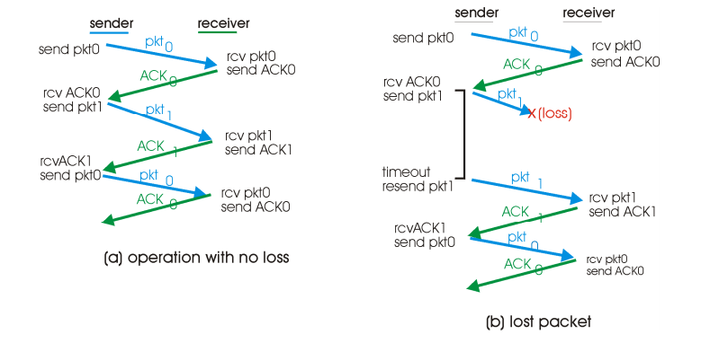

### Rdt 3.0示例(2)

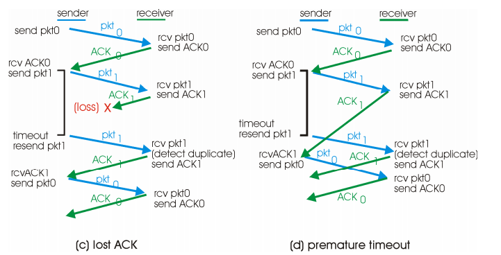

### Rdt 3.0性能分析

==功能正确了，性能如何呢？==

==性能比较差！==

-  Rdt 3.0能够正确工作，但性能很差
-  示例：1Gbps链路，15ms端到端传播延迟，1KB分组
     -  发送方利用率：发送方发送时间百分比（停等协议）
     -  **停等协议导致**（包含ack机制），在1Gbps链路上每30毫秒才发送一个分组33KB/sec
     -  还有**重发**，导致性能下降。但主要是停等协议导致的，因为并发的发送并不占用市场，而且重发是小概率事件。
     -  ==网络协议限制了物理资源的利用==

### Rdt 3.0: 停等操作

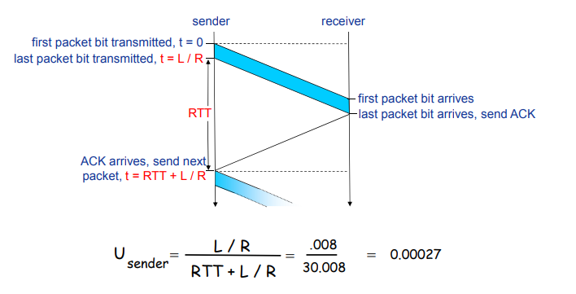

## 流水线机制与滑动窗口协议

### 流水线机制：提高资源利用率

同时发送多个不同的分组。本质上就是提升了分组大小同时保存分组的并发优势。

翻倍提升。

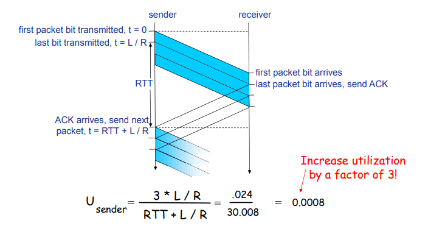

### 流水线协议

-  允许发送方在收到ACK之前连续发送多个分组
     -   更大的序列号范围
     -  发送方和/或接收方需要更大的存储空间以缓存分组
     -  为每个小分组发送ACK。发送多个ack

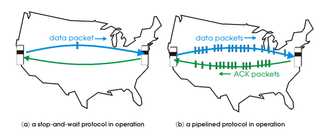

### 滑动窗口协议概述

实现流水线机制的方法。


-  滑动窗口协议: Sliding-window protocol
-  窗口是什么？
     -   允使用的序列号范围
     -  窗口尺寸为N：最多有N个等待确认的消息
-  滑动窗口
     -  随着协议的运行，窗口在序列号空间内向前滑动
-  两种滑动窗口协议：GBN, SR

## Go-Back-N协议

### Go-Back-N(GBN)协议: 发送方

-  分组头部包含k-bit序列号，共2^n个序号可用
-  窗口尺寸为N，最多允许N个分组未确认
     - 绿色：发送并已经确认
     -  黄色：发送未确认
     -  蓝色：可用序列号
     -  白色：可以使用的序列号
-  base：尚未确认的最小号
-  nextseqnum：尚未用但是可以用的最小号
-  ACK(n): 序列号n及n之前(包含n)的分组均已被正确接收
     -  可能收到重复ACK，不是问题
-  为空中的分组设置计时器(timer)
-  超时Timeout(n)事件: 重传序列号未收到对应ACK的**所有分组**（为什么不先发第一个？退化到了rdt3.0）

### GBN: 发送方扩展FSM

refuse：拒绝为上层发送，因为无序号可用。

注意观察timer。


### GBN: 接收方扩展FSM


-  ACK机制: 发送拥有最高序列号的、已被正确接收的分组的ACK
   -  可能产生重复ACK
   -  只需要记住唯一的expectedseqnum，即现在想要的。
-  流水线机制下可能有乱序到达的分组：
   -  gbn下直接丢弃（接收方不设置缓存）
   -  接受正确序号后，重新确认序列号最大的、按序到达的分组

### GBN示例

N=4下。

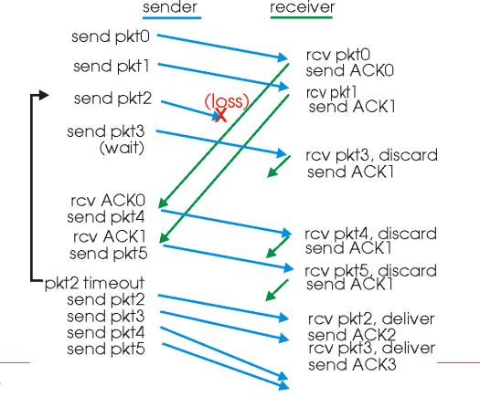

### 练习题

  数据链路层采用后退N帧（GBN）协议，发送方已经发送了编号为0～7的帧。当计时器超时时，若发送方只收到0、2、3号帧的确认，则发送方需要重发的帧数是多少？分别是那几个帧？
  解：根据GBN协议工作原理，GBN协议的确认是累积确认，所以此时发送端需要重发的帧数是4个，依次分别是4、5、6、7号帧。

## SR（Selective Repeat）协议

-  GBN有什么缺陷？重传很多分组。

==**如何解决？**==

- 接收方窗口
  -  接收方对每个分组单独反馈ACK。
  -   接收方设置缓存机制，缓存乱序到达的分组
  -  发送方只重传那些一定时间内，没收到ACK的分组，为每个分组设置定时器。
- 发送方窗口和gbn一样
    -   N个连续的序列号
    - 限制已发送且未确认的分组

### Selective Repeat：发送方/接收方窗口

两个窗口是自用的，并无关联，不对齐。


### SR协议

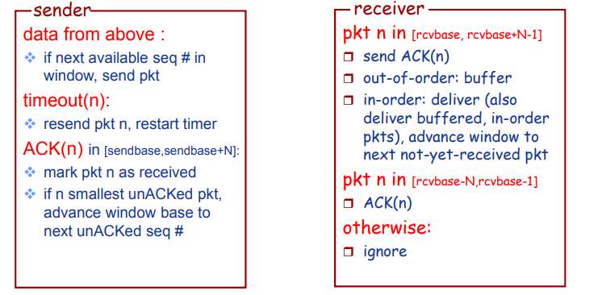

### SR协议示例

$Ns=Nr=4$

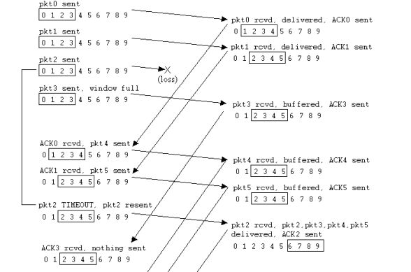

### SR协议：困境

-  序列号: 0, 1, 2, 3
-  窗口尺寸：3
-  接收方能区分开右侧两种不同的场景吗？
     - a是超时
     -  b是3缺失导致0直接发送
     -  接受端无法区分
-  (a)中，发送方重发分组0, 接收方收到后会如何处理？按第二个0接受
-  产生原因：发送接受双窗口相对与序号空间，太大了，导致双窗口能辐射到序号相同但是内容不同的数据包。
-  问题：序列号空间大小与窗口尺寸需满足什么关系？
  -   $NS+NR<=2^k$


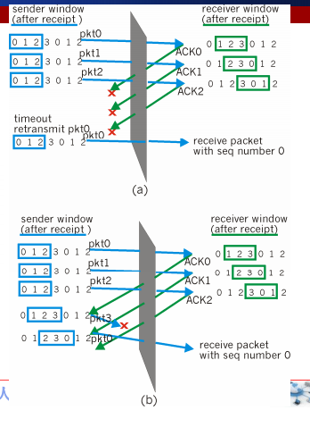

## 可靠数据传输原理与协议回顾

-  信道的(不可靠)特性
-  可靠数据传输的需求
  -  Rdt 1.0
  -  Rdt 2.0, rdt 2.1, rdt 2.2
  -  Rdt 3.0
        -  流水线与滑动窗口协议
            -  GBN
            -  SR