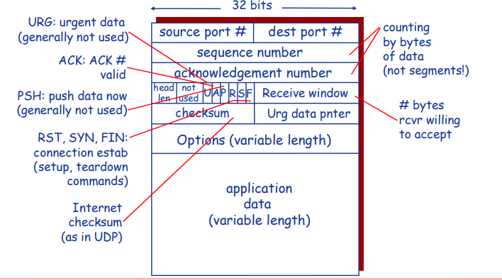

# TCP概述

## TCP概述: RFCs-793, 1122, 1323, 2018, 2581

- 点对点的通信机制
  - 单个tcp连接仅支持 一个发送方，一个接收方，不支持多多连接
- 提供可靠的、按序的字节流传输
- 使用流水线机制提高性能
  -  TCP==拥塞控制和流量控制机制动态调整窗口尺寸==，窗口尺寸不是固定常数
  - 流水线机制采用的具体技术==介于SR与GBN之间，因此发送方/接收方均需要缓存==来满足SR和GBN的要求条件的并集，由于SR需要双方缓存，所以这方面更像SR一些

- 全双工(full-duplex)
  -  同一连接中能够传输双向数据流
- tcp是面向连接，先建立连接再传输数据
  -  tcp是端到端的，因此设计为==连接状态只在连接的两端中维护，在沿途节点中并不维护状态。==
  -  ==管理TCP连接包括：两台主机上的缓存、连接状态变量、socket等==
- tcp提供流量控制机制和拥塞控制机制

## tcp结构

1. ==每行32bits==

2. ==options是可选行，所以tcp数据包的大小是可变的==

3. ==tcp数据包没有length字段==，是因为TCP数据包是包含在IP数据包中的，而IP数据包已有长度字段，除去IP首部和TCP首部，剩余部分就是TCP包的净荷数据。但是由有head  length字段。

4. 序列号是指该报文段在发送方数据字节流中的位置，在TCP字节流中，每个数据字都被编号。

   确认号是指本机希望收到的下一个字节的序号；

   序列号和确认号分别对应报文发送方向和相反方向的数据流；

   报文被分解成多个报文段时，序列号就是首字节在整个报文中的偏移量，确认号指定下一个期待的字节；

5. 标志位

 	URG：紧急指针有效

   ​        ACK：确认ack number字段是否有效，而不是ack本身

   ​        PSH：push，接收方尽快将这个报文段交给应用层。一般没啥用

​           RST、 SYN、FIN：用于tcp连接的建立和拆除

6. 窗口大小：告诉数据接受方，发送方的接受窗口大小。

## TCP: 序列号和ACK

- 序列号:
  -  ==序列号指的是segment中第一个字节的编号，而不是segment的编号==
  -  ==建立TCP连接时，双方共同商议开始的两个序列号，一方一个初始序列号==
- ACK（acknowledge） number:
  -  希望接收到的下一个字节的序列号，也不是segment的编号
  -  ==tcp采用GBN式的累计确认机制==：该序列号之前的所有字节均已被正确接收到（包括该序列号吗？）
- Q: 接收方如何处理乱序到达的Segment？
  -  A: GBN丢弃，SR缓存，而==TCP规范中没有规定==，由TCP的实现者做出决策

## 例子

telnet远程登录服务。

初始的seq=42和ack=79是在图示第一次交换data=‘C’之前建立了tcp连接过程中AB两台主机商定的

# TCP可靠数据传输

## TCP可靠数据传输概述

- TCP在IP层提供的不可靠服务基础上实现可靠数据传输服务
- 流水线机制
- 累积确认
- ==TCP使用GBN式的单一重传定时器==

- 触发重传的事件
  -  超时
  -  收到重复ACK
- 这一小节并不完整，我们渐进式的了解tcp。在这一小节
  -  暂不考虑重复ACK
  -  暂不考虑流量控制
  -  暂不考虑拥塞控制

## TCP RTT和超时：如何设置定时器的超时时间？

- **问题：如何设置定时器的超时时间？RTT是一个重要的参考值**
- timeout一定要大于RTT：
  -  但是RTT是变化的
- 相对RTT过短：
  -  不必要的重传
- 相对RTT过长：
  -  对段丢失时间反应慢
- ==我们要找到一个略大于实际RTT的值作为timeout==

- ==问题：如何估计RTT？==
- SampleRTT: 测量从段发出去到收到ACK的时间
  -  这样的参考值忽略重传，即不会发生timeout，即无丢失，无乱序
- 噪声处理：
  -  测量多个SampleRTT，求平均值，形成RTT的估计值EstimatedRTT
  - ==在线学习估计RTT==，使用新数据不断更新

- ==timeout=EstimatedRTT+f（EstimatedRTT变化程度剧烈）==
  -  EstimatedRTT + “安全边界”：要求timeout>RTT
  -  EstimatedRTT变化程度剧烈->较大的边界
  - 安全边界=f（EstimatedRTT变化程度剧烈）
- ==在线学习EstimatedRTT的变化程度==: SampleRTT与EstimatedRTT的差值
  - 
- 定时器超时时间的设置：==超参数设置为4==
  - 

## TCP发送方事件

- 从应用层收到数据
  -  创建Segment
  -  序列号是Segment第一个字节的编号
  -  开启计时器
  -  设置超时时间：TimeOutInterval
- 发生超时
  -  ==重传引起超时的Segment，只重传引起超时的那一个segment，这和GBN、SR都不同，具体见下面发送端程序==
  -  重启定时器
- 收到ACK
  -  如果确认此前未确认的Segment
    - • 更新SendBase
    - • 如果窗口中还有未被确认的分组，重新启动定时器（tcp计时器唯一）

## TCP发送端程序

1. 注意，event1中如果timer已经启动就不再启动timer，因为timer只有一个
2. event1中nextseqnum的更新
3. event2展示了单timer下tcp的timeout是如何与GBN不同的
4. event3中，y，即acknum，指的是最小的尚未确认的序号，即y以前的均ack，但不包括y，base=y。而之前讨论的GBN的acknum是包括y也ack了，base=y+1。这点不同。而base均是最小序号确认，没区别。
5. 关于重发和计时器：三者均是timer没有则设置timer。仅仅timeout会重发
   1. 新data，当timer没有被设置时设置timer
   2. timeout：重发并重设timer
   3. rec-acknum：重设base，如果有没被ack的段，且timer未开启则设置timer

## TCP重传示例

## 接收方：TCP ACK生成: RFC 1122, RFC 2581

1. 有序到达
   1. 延迟等待
   2. 等待成功
2. 乱序到达
   1. 立即发送重复ack

## 快速重传机制-除了timerout的重传机制

- 原因：TCP的实现中，如果发生超时，超时时间间隔将重新设置，即将超时时间间隔加倍，导致其很大：1丢失在timeout之前，但是恰好timeout在1丢失ack到达之前触发，使得1丢失重发多等待1个timeout
  -  重发丢失的分组之前要等待很长时间
- 原理：通过重复的ACK来检测分组丢失
  -  Sender会背靠背地发送多个分组
  -  如果某个分组丢失，可能会引发多个重复的ACK
- 具体操作：==如果sender收到对同一数据的3个ACK，则假定该数据之后的段已经丢失==
  -  ==快速重传：在定时器超时之前即进行重传==

## 快速重传算法

==为什么是3次？？==

# TCP流量控制

接收方为TCP连接分配buffer

 上层应用可能处理buffer中数据的速度较慢，导致数据溢出

流量控制本质上是速度匹配机制

具体做法：

假定TCP receiver丢弃乱序的segments：
 Buffer中的可用空间(spareroom)= RcvWindow= RcvBuffer-[LastByteRcvd -LastByteRead]

 Receiver通过在Segment的头部字段将RcvWindow 告诉Sender
 ==Sender限制自己已经发送的但还未收到ACK的数据==不超过接收方的空闲RcvWindow尺寸
 Receiver告知sender，SenderRcvWindow=0,会出现什么情况？

即使recwindows=0,也可以进行继续数据的交换，来交换recwin的信息。

==？？？？？？==

# TCP连接管理

- TCP sender和receiver在传输数据前需要建立连接
- 初始化TCP变量
  -  Seq. # （#指的是seq的初始值）
  -  Buffer和流量控制信息
- Client：连接发起者
  - Socket clientSocket = new Socket("hostname","port number");
- Server: 等待客户连接请求
  - Socket connectionSocket =welcomeSocket.accept();
- Three way handshake:三次握手
  - Step 1: ==client== host sends TCP ==SYN segment== to server
    - SYN位置为1
    -  specifies initial seq #，client的初始序列号
    -  no data，不包含数据
  - Step 2: ==server== host receives SYN, replies with ==SYNACK segment==
    -  server allocates buffers服务器为tcp连接分配缓存
    -  specifies server initial seq. #
  - Step 3: ==client== receives ==SYNACK, replies with ACK segment, which may contain data==，这里不设只syn位
- ==两次行不行？==

## TCP连接管理：建立

注意观察syn

## TCP连接管理：关闭

- 一般是客户机关闭
- Closing a connection:
- client closes socket: clientSocket.close();
- Step 1: client向server发送TCP FIN 控制segment
- Step 2: server 收到FIN, 回复ACK. 发送尚未发完的信息，关闭连接, 发送FIN.
- Step 3: client 收到FIN, 回复ACK，并进入“等待” –如果收到重发的FIN，会重新发送ACK
- Step 4: server收到ACK. 连接关闭. 

